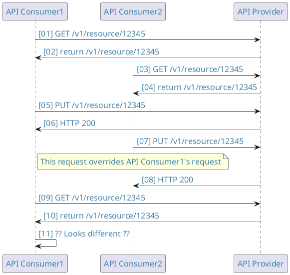

<ApiStandard id="HNZAS_MUST_USE_HTTP_VERBS" type="MUST" toolTip="Access to REST APIs MUST use standard HTTP verbs: GET, PUT, POST, DELETE as per W3C standards.">Access to REST APIs **MUST** be via the standard HTTP verbs: GET, PUT, POST, DELETE in line with the [<u>W3C Standard</u>](https://www.w3.org/2001/tag/doc/whenToUseGet.html)</ApiStandard>

| Verb  | Common Usage|
| :---------- | :------------ |
| **GET**     | For retrieval of information. If the interaction is more like a question (i.e. it is a safe operation such as a query) |
|             |
| **POST**    | To create a piece of information or resource item. To spawn an action. If the interaction is like placing an order. If the interaction changes the state of the resource in a way that the user would perceive (e.g. a subscription to a service). If the user be held accountable for the results of the interaction |
|             |
| **PUT**     | To update an existing resource item. To replace an existing resource item |
|             |
| **DELETE**  | To delete a resource item |
|             |
| **OPTIONS** | To retrieve information about what the consumer is allowed to do with the resource |
|             |
| **PATCH**   | Not recommended due to complexity |
|             |
| **HEAD**    | Rarely used, but used to retrieve metadata about a resource |

## GET

GET is used:

- For retrieval of information

- If the interaction is more like a question (i.e. it is a safe operation such as a query)

The HTTP GET method is used to read (or retrieve) a representation of a
resource. It can be used to retrieve information about an individual
resource (e.g. `/payments/123456`) or to retrieve a collection (list) of
resources (e.g. `/payments`).

In the "happy" (non-error) path, GET returns a representation in `JSON`
and an HTTP response code of 200 (OK).

If the resource does not exist the server
returns a 404 (NOT FOUND).

According to the HTTP specification, GET (along with HEAD) requests are
used only to read data and not change it. Therefore, they are considered
safe when used this way. That is, they can be called without risk of
data modification or corruption - calling it once has the same effect as
calling it 10 times. GET is idempotent, which means that making multiple
identical requests ends up having the same result as a single
request. Do not expose unsafe operations via GET - it should never
modify any resources on the server.

### GET Examples

```bash
# Request
GET "https://api.example.govt.nz/customers/12345"
Accept: application/json,version=1.\*
Accept-Encoding: gzip,deflate
Host: api.example.govt.nz
```

```json
# Success Response

Content-Length: 612
Location: "https://api.example.govt.nz/customers/12345"
Date: Fri Jul 08 16:52:21 NZST 2016
CorrelationID: 65347f577ade5f7750234abb
Transaction-Id: 65347f577bde5949ac7bd448

{
  "id": 12345
  "names": {
    "firstName": "John",
    "middleName": "Howard",
    "lastName": "Doe",
    "salutation": "Mr John Doe",
    "title": "Mr"
  },
 "addresses": [
    {
      "type": "home",
      "address1": "1 Some Street",
      "address2": "Some Suburb",
      "address3": "Some City",
      "address4": null,
      "country": "New Zealand",
      "postcode": 1111
    },
    {
      "type": "business",
      "address1": "2 Work Street",
      "address2": "Work Suburb",
      "address3": "Work City",
      "address4": null,
      "country": "New Zealand",
      "postcode": 2222
    }
  ]
}
```

```bash
GET <https://api.example.govt.nz/customers/12345/appointments>
```

```bash
GET <https://api.example.govt.nz/facilities/98765/staff>
```

Some API GET calls will return a single resource item whilst some calls
will return a collection of resource items. See [<u>section Singletons vs. Collections</u>](Content#singletons-vs-collections) for more
details

## POST

POST is used:

- To create a piece of information or resource item

- To spawn an action

- If the interaction is like placing an order

- If the interaction changes the state of the resource in a way that
  the user would perceive (e.g. a subscription to a service)

- If the user be can held accountable for the results of the interaction

The POST verb is most-often utilized to create new resources. In
particular, it is used to create sub-resources: that is, subordinate to
some other (e.g. parent) resource. In other words, when creating a new
resource, POST to the parent and the API takes care of associating the
new resource with the parent, assigning an ID (new resource URI),
etc. On successful creation, POST returns an HTTP status 201, with a
Location header containing a link to the newly created resource.

POST is neither safe nor idempotent. It is therefore recommended for
non-idempotent resource requests. Making two identical POST requests
will most-likely result in two resources containing the same
information.

The body content of a POST request will differ to that of a PUT, as the
provider will create certain values such as a unique identifier for the
resource and its creation date.

In many cases a POST may have a small subset of the data that can exist
on a resource – a subsequent PUT to the resource can be performed to
populate the data.

### POST Examples

```json
# Create a new customer resource

POST <https://api.example.govt.nz/customers>
{
  "names": {
    "firstName": "John",
    "middleName": "Howard",
    "lastName": "Doe",
    "salutation": "Mr John Doe",
    "title": "Mr"
  },
  "addresses": [
    {
      "type": "home",
      "address1": "1 Some Street",
      "address2": "Some Suburb",
      "address3": "Some City",
      "address4": null,
      "country": "New Zealand",
      "postcode": 1111
    },
    {
      "type": "business",
      "address1": "2 Work Street",
      "address2": "Work Suburb",
      "address3": "Work City",
      "address4": null,
      "country": "New Zealand",
      "postcode": 2222
    }
  ]
}
```

```json
# Successful resource creation response

HTTP/1.1 201 Created
Location: <https://api.example.govt.nz/customers/12345>
Content-Location: <https://api.example.govt.nz/customers/12345>
Content-Type: application/json

{
  "id": 12345,
  "names": {
    "firstName": "John",
    "middleName": "Howard",
    "lastName": "Doe",
    "salutation": "Mr John Doe",
    "title": "Mr"
  },
  "addresses": [
    {
      "type": "home",
      "address1": "1 Some Street",
      "address2": "Some Suburb",
      "address3": "Some City",
      "address4": null,
      "country": "New Zealand",
      "postcode": 1111
    },
    {
      "type": "business",
      "address1": "2 Work Street",
      "address2": "Work Suburb",
      "address3": "Work City",
      "address4": null,
      "country": "New Zealand",
      "postcode": 2222
    }
  ]
}
```

## PUT

PUT is used:

- To update an existing resource item

- To replace an existing resource item

PUT is most-often utilized to update information, PUT-ing to a known
resource URI with the request body containing the newly updated
representation of the original resource.

However, PUT can also be used to create a resource in the case where the
resource ID is chosen by the consumer instead of by the API itself:
where PUT is to a URI that contains the value of a non-existent resource
ID. Again, the request body contains a resource representation. **This method of resource creation should be avoided** or used sparingly. If
consumer-defined resource IDs are required, use POST to create the new
resource and provide the consumer-defined ID in the body representation
(see POST).

On a successful update, PUT returns 200 (or 204 if not returning any
content in the body). If using PUT to create, return HTTP status 201 on
successful creation. A body in the response is optional. It is not
necessary to return a link via a Location header in the creation case
since the consumer already knows the resource ID, having set it
themselves.

PUT is not a safe operation: it modifies (or creates) state on the
server, but it is idempotent. I.e. if you create or update a resource
using PUT and then make that same call again, the resource is still
there and still has the same state as it did with the first call.
However, were the PUT call to increment a counter within the resource,
the call is no longer idempotent. Sometimes this is necessary behaviour,
and it may be enough to document that the call is not idempotent.
However, it's recommended to keep PUT requests idempotent. It is
strongly recommended to use POST for non-idempotent requests.

It is good practice to perform a GET on a resource before you perform a
PUT. This means that the consuming application has the latest
representation of that resource. PUT should contain the entire resource
content in the message body. By performing a GET prior to the PUT the
consuming application can re-send the results of the GET with any
modifications.

When using a resource response cache, any PUT to a resource should
invalidate that cache or re-populate the cache with the updated
resource.

[API Providers](../../api-concepts/ComponentDefinitions#api-provider) and [API Consumers](../../api-concepts/ComponentDefinitions#api-consumer) **MUST** design APIs that are PUT tolerant. What this means is that both producers and consumers should be aware that the resource that is `PUT` to the server becomes the most up to date representation of that resource. This exposes the `PUT` method to a commonly found race condition. This condition is explained in the simple sequence below.



<DetailedDescription text="In this sequence diagram there are 2 API consumers that are interacting with the same API resource. The first, API Consumer1, retrieves the resource at the same time as API Consumer2. API Consumer1 then updates the resource with a PUT request. Very soon after, API Consumer2 updates the same resource however it does not contain the changes submitted by API Consumer1. API Consumer1 then retrieves the resource and is confused as it does not contain the changes that it submitted." />

There are a two ways that this behavior can be handled by the API Provider such as:

- [Optimistic concurrency control](./Version%20Control#resource-version-control "Click to see details on optimistic concurrency")
- [Pessimistic concurrency control](./Version%20Control#resource-version-control "Click to see details on pessimistic concurrency")

### PUT Examples

```json
# Get a resource

GET "https://api.example.govt.nz/customers/12345/appointments/1w3r4y6u"
# Note that the same resource could potentially be retrieved using "https://api.example.govt.nz/appointments/1w3r4y6u"

# Response Body

{
  "id": "1w3r4y6u",
  "customer": {
    "firstName": "NICOLAS",
    "lastName": "SMITH",
    "salutation": "Mr",
    "preferredName": "NICOLAS",
    "id": "ZZ112233"
  },
  "dateTime": "2023-11-07T10:45:00.000Z",
  "bookingMethod": "email",
  "practitioner": {
    "type":"GP",
    "id":"1JH3344",
    "firstName": "Some",
    "lastName": "Practitioner",
    "salutation": "Dr"
  }
}
```

```json
# Put to a resource (update) changing the appointment date, time and practitioner

PUT "https://api.example.govt.nz/customers/12345/appointments/1w3r4y6u"

# Request Body

{
  "id": "1w3r4y6u",
  "customer": {
    "firstName": "NICOLAS",
    "lastName": "SMITH",
    "salutation": "Mr",
    "preferredName": "NICOLAS",
    "id": "ZZ112233"
  },
  "dateTime": "2023-11-10T08:30:00.000Z",
  "bookingMethod": "email",
  "practitioner": {
    "type":"GP",
    "id":"1JH3355",
    "firstName": "Another",
    "lastName": "Practitioner",
    "salutation": "Dr"
  }
}
```

```bash
# Response that update was successful
HTTP/1.1 204 No Content
Content-Location: /customers/12345/appointments/1w3r4y6u
```

## DELETE

DELETE is used:

- To delete a resource item

DELETE is only used to delete a resource identified by a URI.

On successful deletion, DELETE returns an HTTP status 200 (OK) along
with a response body, and optionally the representation of the deleted
item, or a wrapped response. Alternatively, DELETE can return HTTP
status 204 (NO CONTENT) with no response body indicating that the DELETE request was successful.

DELETE operations are idempotent. If you DELETE a resource, it is
removed. Repeatedly calling DELETE on that resource ends up as the same
result: the resource is gone. However, calling DELETE on a resource a
second time will often return a 404 (NOT FOUND) since it was already
removed and therefore is no longer findable. This, in some opinions,
makes DELETE operations no longer idempotent, but the end-state of the
resource is the same. Returning a 404 is acceptable and communicates
accurately the status of the call. If calling DELETE were to decrement a
counter (within the resource), the DELETE call is no longer idempotent.

### DELETE Examples

```bash
# Delete a resource

DELETE <https://api.example.govt.nz/appointments/1w3r4y6u>
```

```bash
# Response
HTTP/1.1 204 No Content
Content-Location: /appointments/1w3r4y6u
```

## OPTIONS

OPTIONS is used to retrieve information about what the consumer is
allowed to do with the Resource. OPTIONS calls are predominantly (though not exclusively) used where a single page application (SPA) user interface (UI) is performing pre-fetch operations on an API or to understand the capabilities of an API.

The OPTIONS method typically returns an HTTP response with a status code of 200 OK, along with a set of headers that disclose the supported HTTP methods, allowed headers, and other relevant information. This response empowers clients to make informed decisions about their subsequent interactions with the API.

## Other

### PATCH

PATCH is a valid HTTP verb, but is still in draft and its use is discouraged due to complexity. An exception to this might be where an adopted standard, such as FHIR is in use. [<u>FHIR Patch</u>](https://www.hl7.org/fhir/http.html#patch) and the API Provider FHIR server supports safe PATCH operations.

### HEAD

HEAD is used to retrieve metadata about a resource, such as when it was
last updated or the associated response headers. The response to a HEAD
request MUST NOT contain a body. If a response body is returned it MUST
be ignored.
