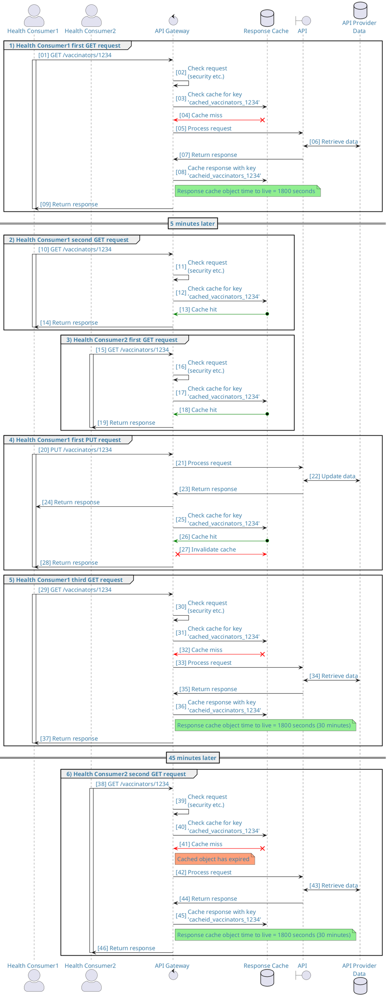
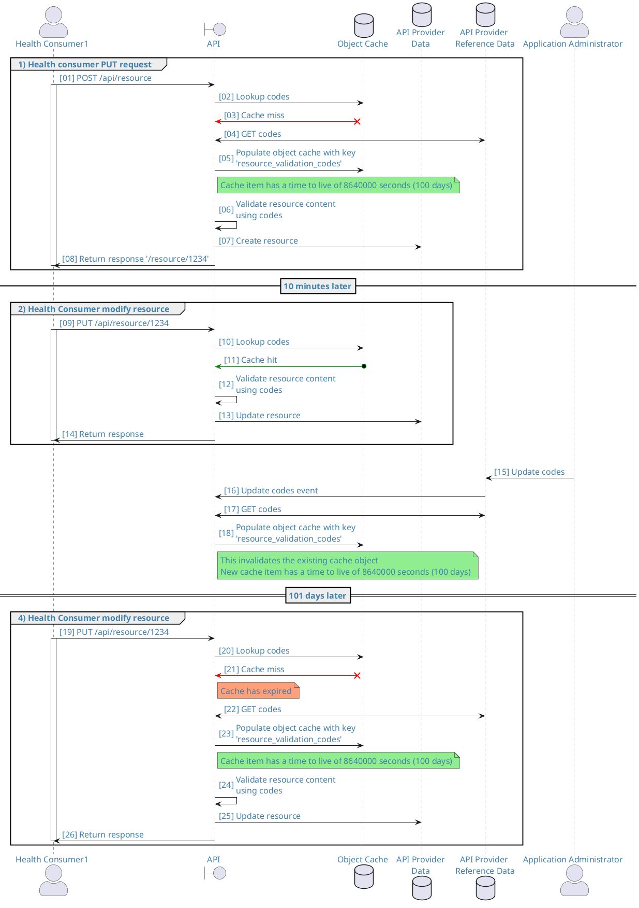

<ApiStandard id="HNZAS_SHOULD_USE_CACHING_FOR_INFREQUENTLY_CHANGED_DATA" type="SHOULD" toolTip="Caching SHOULD be used for data which is frequently accessed but does not change very often">Caching enables faster responses from APIs and reduces server load. It is good for information which is frequently requested but does not change very often. The aim is to retrieve information once but re-use
many times.</ApiStandard>

There are a number of caching methodologies available. This section
focuses on two types of caching that should be owned and controlled by
the API Provider.

## Response Cache

A response cache is a cache that contains the response to a GET request
on a unique resource. The response should be cached as close to the
consumer as possible while remaining inside the security and control boundaries of
the agency. Response caches are usually fast, in-memory caches. Many off
the shelf API gateway/management solutions provide a built-in response
cache. 

<ApiStandard id="HNZAS_SHOULD_MONITOR_RESPONSE_CACHE" type="SHOULD" toolTip="API Providers SHOULD monitor their response cache to minimize stale objects and ensure sufficient system memory for caching loads.">When using a response cache, API Providers **SHOULD** ensure that they understand and monitor their cache to ensure that stale objects are kept to a minimum and that they have sufficient system memory to service caching loads. This means ensuring that the cache is refreshed once a user has updated the information or a cache timeout has occurred.</ApiStandard>

Consider the following example regarding response cache:

<DetailedDescription text="The diagram illustrates a simplified interaction between two health consumers, Health Consumer 1 and Health Consumer 2, and an API gateway. The diagram highlights the role of a response cache in optimizing performance and reducing load on the API. Group 1 - Initial Requests and Cache Utilization. Health Consumer 1's First GET Request: Health Consumer 1 sends a GET request to the API gateway to retrieve information about vaccinators. The API gateway checks the request for security and then checks the response cache for the corresponding key. Since the cache miss triggers, the API gateway forwards the request to the API, which retrieves the data from the API provider's database. The API then returns the response to the API gateway, which caches it and sends it back to Health Consumer 1. 5 Minutes Later: Health Consumer 1 sends another GET request for the same information. The API gateway follows the same process, but this time, the response cache hit occurs, and the cached response is directly returned to Health Consumer 1, saving time and reducing load on the API. Group 2 - Health Consumer 2's First GET Request: Health Consumer 2 also sends a GET request for vaccinator information. The API gateway checks the request and the cache, and since the cache hit occurs, the cached response is directly returned to Health Consumer 2. Group 3 - Cache Invalidation and Subsequent Requests: Health Consumer 1's First PUT Request: Health Consumer 1 sends a PUT request to update the vaccinator information. The API gateway forwards the request to the API, which updates the data in the API provider's database. The API then returns the response to the API gateway, which sends it back to Health Consumer 1. After receiving the successful update confirmation, the API gateway checks the cache for the corresponding key and invalidates it to ensure the next GET request retrieves the updated information. Health Consumer 1's Third GET Request: Health Consumer 1 sends another GET request for vaccinator information. Since the cached data is invalidated, the API gateway forwards the request to the API, which retrieves the updated data from the database. The API then returns the response to the API gateway, which caches it and sends it back to Health Consumer 1. Cache Expiration and Cache Miss: 45 Minutes Later: Health Consumer 2 sends another GET request for vaccinator information. The API gateway checks the request and the cache, but this time, the cache miss occurs due to the cache object's expiration. The API gateway displays a note indicating the cached object has expired and forwards the request to the API. The API retrieves the updated data from the database and returns the response to the API gateway, which caches it and sends it back to Health Consumer 2. In summary, the PlantUML diagram demonstrates how a response cache can effectively improve performance and reduce load on the API by caching frequently accessed data and invalidating it when necessary. This caching mechanism ensures that subsequent requests for the same data can be served directly from the cache, minimizing the need for repeated data retrieval and reducing the overall response time." />

## Object Cache

An object cache is used to cache objects that are fundamental to the
function of an API but may not change on a regular basis. For example,
an API may include a SNOMED code validation step. Tax code references are
held in a back-end database. To prevent redundant requests to the
database, the API layer could cache tax codes in its object cache and
refer to these until the cache becomes invalid. The diagram below
details an example sequence.

<DetailedDescription text="The diagram illustrates the interactions between a Health Consumer, an API, an Object Cache, an API Provider Data database, an API Provider Reference Data database, and an Application Administrator. It highlights the role of the Object Cache in storing frequently accessed codes and how the administrator can update these codes, invalidating the cache. Initial Resource Creation and Cache Utilization. Health Consumer PUT Request: Health Consumer 1 sends a PUT request to create a resource. The API first checks the Object Cache for the validation codes used to validate the resource content. Since the cache miss occurs, the API retrieves the codes from the API Provider Reference Data database. The API then stores the codes in the Object Cache with a time-to-live (TTL) of 100 days and validates the resource content using the codes. Finally, the API creates the resource in the API Provider Data database and returns a response to the Health Consumer. Subsequent Resource Modification and Cache Hit. 10 Minutes Later: Health Consumer 1 sends another PUT request to modify the resource. The API again checks the Object Cache for the validation codes and this time, the cache hit occurs. The API uses the cached codes to validate the resource content and updates the resource in the API Provider Data database. Finally, it returns a response to the Health Consumer. Reference Data Updates and Cache Invalidation. Codes Updated by Administrator: The Application Administrator updates the validation codes in the API Provider Reference Data database. The API Provider Reference Data database sends an event to the API, notifying it of the updated codes. The API retrieves the updated codes from the API Provider Reference Data database and stores them in the Object Cache, invalidating the existing cache object. The new cache object has a TTL of 100 days. Cache Expiration and Cache Miss. 101 Days Later: Health Consumer 1 sends another PUT request to modify the resource. The API checks the Object Cache for the validation codes and this time, the cache miss occurs due to the cache object's expiration. The API retrieves the updated codes from the API Provider Reference Data database and stores them in the Object Cache, invalidating the existing cache object. Finally, it validates the resource content using the codes, updates the resource in the API Provider Data database, and returns a response to the Health Consumer." />
