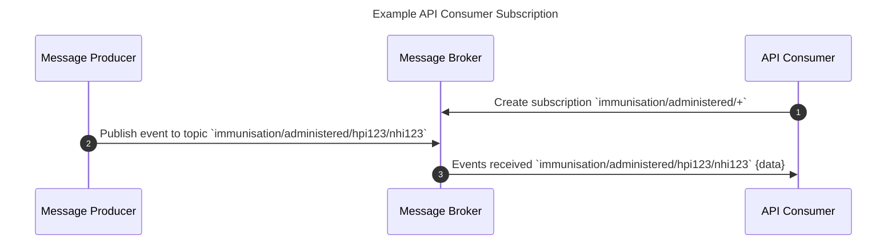

In Asynchronous messaging APIs, a `Message Producer` uses topics as a means to route messages to interested API Consumers. An 
`API Consumer` uses topics within their subscriptions to filter the messages they wish to receive.

A well architected and consistent topic design is crucial to the success and re-usability of an event-driven API.

## Topic design

### Recommendations

The event topic design **MUST** be consistently applied once agreed upon, and root levels of the topic **MUST NOT** change meaning.

For example, if the event topic root of an event is formed using the structure `{domain}/{action}`, such as `immunisation/administered`, then this **MUST** be followed for subsequent topics, for example `practicing_certificate/issued`, as opposed to `issued/practicing_certificate`. Individual events **MAY** utilise their own topic hierarchy below the root level however these **SHOULD** aim to be as consistent as possible with existing topics, where appropriate.

When a topic is defined, multiple "levels" may be defined, which are separated by a topic level separator, for example `{level1}/{level2}`.

<ApiStandard id="HNZAS_MUST_TOPIC_SEPARATION" type="MUST" toolTip="Different topic items MUST be separated by a `/`." >Different topic items **MUST** be separated by a `/` as opposed to any form of concatenation such as `{domain}-{action}` to support subscription filtering across different consumption protocols.</ApiStandard>

<ApiStandard id="HNZAS_SHOULD_TOPIC_LOWERCASE" type="MUST" toolTip="Topics SHOULD be lowercase." >Topics are case-sensitive in most message broker technologies, so using lower case is **RECOMMENDED**.</ApiStandard>

<ApiStandard id="HNZAS_SHOULD_TOPIC_SPECIAL_CHARS" type="MUST" toolTip="Topics SHOULD avoid using any special characters." >It is **RECOMMENDED** to avoid using any special characters as these often have a reserved use in some messaging protocols and message broker implementations, which are often not defined in protocol specifications (e.g. `$SYS/monitor/+` as a system monitoring topic).</ApiStandard>

In general, the below topic design can be used, or expanded for each use case - for example, to add a sub-identifier:

`{domain}/{action}/{identifier}`

| Topic level | Description | Example |
| - | - | - |
|Domain|The domain of the event.|`immunisation`, `patient`, `practicing_certificate` |
|Action|The action that occurred within the domain. This should be a past tense verb, where HTTP verbs should be avoided.|`administered`, `created`, `issued`, `expired`, `address_updated`, `revoked`|
|Identifier|An identifier for the subject of an event|`NHI123`, `HPI123`|

<ApiStandard id="HNZAS_MAY_TOPIC_LEVEL_VERSION" type="MAY" toolTip="Topic level MAY be used to indicate different versions of an event." >A topic level **MAY** be used to indicate different versions of an event, where API Consumers may have a different consuming application between versions, or to manage migrations without breaking changes.</ApiStandard>

<ApiStandard id="HNZAS_MUST_TOPIC_LEVEL_VERSION" type="MUST" toolTip="If topic level is used to indicate different versions of an event, the version MUST also be indicated in the message body or header." >In these cases the event version can be appended as a topic level, however the version **MUST** also be indicated in the message body or header.</ApiStandard>

### Examples

Topic design **MUST** consider the foreseen use cases of the event.

As an example, consider the publication of an Immunisation administered event. When an Immunisation is administered, it is likely that there are many parties who are interested in this event. These may be:

- the Aotearoa Immunisation Register (AIR)
- the Health Consumer's GP Practice

An ideal topic hierarchy will allow both API Consumers to filter their subscription to only allow relevant events.

An example of a topic that does not meet these requirements:

`immunisation/administered`

The above topic would work for AIR as an API Consumer, as they are likely to be interested in all immunisation events. However, this topic design does not allow the GP practice to filter for immunisation events related to their practice. A topic design which uses wildcard segments provides the API Consumers with much greater control and flexibility. An improved topic design to meet this use case:

`immunisation/administered/{patientFacilityId}/{nhi}`

Where a facility such as a the Health Consumer's GP Practice could subscribe to all immunisation administered events using a wildcard filter such as `immunisation/administered/F1X017-K/*`, which would receive only events for their practice. An API Consumer interested in all immunisation administered events can subscribe to `immunisation/administered/>`

When this topic hierarchy is shared amongst more events, this allows consistency and efficiency for both API Producers and Consumers.

## Subscription handling

<ApiStandard id="HNZAS_MUST_BROKER_SUBSCRIPTION" type="MUST" toolTip="A message producer MUST provide mechanisms for API Consumers to use to subscribe or unsubscribe from available message channels." >A subscription is the mechanism where API Consumers define which events they would like to receive. A message producer **MUST** provide mechanisms for API Consumers to use to subscribe or unsubscribe from available message channels.</ApiStandard>

<ApiStandard id="HNZAS_SHOULD_BROKER_FHIR" type="SHOULD" toolTip="A message producer for systems implementing the FHIR Standard, the FHIR Subscriptions Model SHOULD be the preferred mechanism to manage this subscription." >For systems implementing the FHIR Standard, the FHIR Subscriptions Model **SHOULD** be the preferred mechanism to manage this subscription.</ApiStandard>

<ApiStandard id="HNZAS_MUST_WILDCARD_TOPIC" type="MUST" toolTip="An API Provider **MUST** support the ability for an API Consumer to subscribe to topics using wildcards." >An API Provider **MUST** support the ability for an API Consumer to subscribe to topics using wildcards.</ApiStandard>

Different messaging protocols will support different wildcard characters, for example, MQTT uses `+` for a single level wildcard and `#` for a multi-level wildcard, however other implementations use `*` and `>`.

The wildcard characters supported by the API Provider **MUST** be documented alongside the API.

<DetailedDescription text="The diagram shows an example of an API Consumer subscribing to a topic using a wildcard.
The API Consumer sends a message to the message broker to create a subscription to the topic immunisation/administered/+. The + wildcard character matches any single level of the topic.
The message producer publishes an event to the topic immunisation/administered/hpi123/nhi123.
The message broker forwards the event to the API Consumer because the event matches the subscription filter.
The API Consumer will receive all events published to the immunisation/administered topic, regardless of the value of the third level of the topic."/>