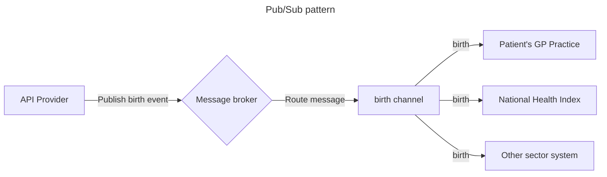

:::info
API Providers **SHOULD** use the Pub/Sub pattern for integration event messages published within the Health sector, as it is most suited to increasing interoperability
:::

## Publish-Subscribe (Pub/Sub)

In the Publish-Subscribe (Pub/Sub) pattern, an API Provider publishes events or messages to be delivered to none, one, or many consumers. This pattern de-couples the message producer and consumers by publishing the message to an event broker rather than communicating directly with consumers. The message broker broadcasts the messages to API Consumers, which means that the API Consumers are not directly coupled to the API Provider, and the API Provider has no concern whether or not a message has been received. Each consumer gets pushed a copy of of the message, unlike [Point to Point](./03-PointToPoint.md) where messages are pulled from the queue.

A typical Pub/Sub implementation can be modelled by the below.

In this example, multiple consuming systems, National Health Index, Patient's auto enrolled GP and other sector systems are all delivered a copy of the `birth` event. This allows all API Consumers to use the information contained within the event.

### When to use this pattern

- An application needs to broadcast information to a significant number of consumers, such an an Immunization Administered event
- An application needs to communicate with one or more independently-developed applications or services, which may use different platforms, programming languages, and communication protocols
- An application needs to send information to consumers without requiring real-time responses from the consumers
- The systems being integrated are designed to support an eventual consistency model for their data
- When no acknowledgement is required by the API Provider that the event has been received or processed
