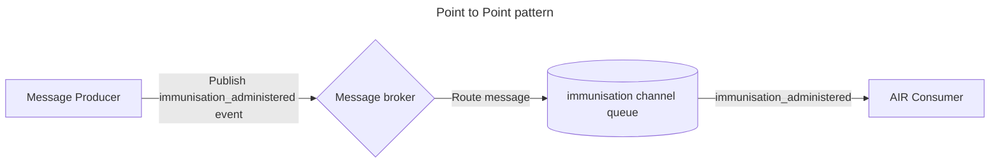
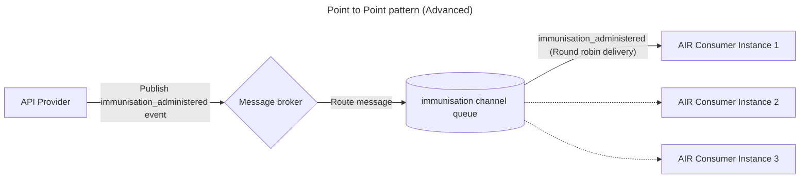

## Point to point

The point-to-point message exchange pattern is used to deliver messages to a **single** API Consumer in what’s called a "one-to-one" exchange, typically using a message queue.

In this pattern messages are published by a Message Producer to a queue. The API Consumer processes the messages from the queue, before acknowledging them as consumed. Unlike the [PubSub](./02-PubSub.md) pattern, a single message is received **at most once**.

The below is a fictional example of a Point to Point channel.

<DetailedDescription text="In the diagram, there is an Message Producer, a message broker, queue, and an API Consumer. The Message Producer publishes an immunisation_administered event to the message broker, and the message broker then routes the event to queue for consumption by the API Consumer."/>

In example above, the **single** API Consumer, AIR, is consuming `immunisation_administered` events from the `immunisation channel` queue.

### When to use this pattern

- When there is only going to be a single consumer of a message. If more than one consumer is required the [Publish-Subscribe](./02-PubSub.md) pattern may be better suited
- When fault tolerance is required, as messages are only removed from a queue after a single consumer has processed the message
- When there is a requirement for high concurrency of messaging processing, as the processing workload can be horizontally scaled

### Advanced use cases

Advanced uses cases of the point-to-point pattern can be advantageous when designing resilient consumers, for example, one consumer may maintain multiple instances for high availability. While both instances are connected to the single queue, they become "competing consumers", where **at most one** will process the message, often in a round robin fashion. This enables a level of resilience without the two instances needing to know whether or not the other instances are online and processing messages, meaning there is reduced coupling between independent instances. Note that if the ordering of messages is important to the use case, this will need to be managed appropriately.

<DetailedDescription text="In the diagram, there is an Message Producer, a message broker, queue, and an API Consumer. The Message Producer publishes an immunisation_administered event to the message broker, and the message broker then routes the event to queue for consumption by the API Consumer. The single API Consumer, AIR, maintains competing consumers where a single message is consumed at most once, by any one instance."/>