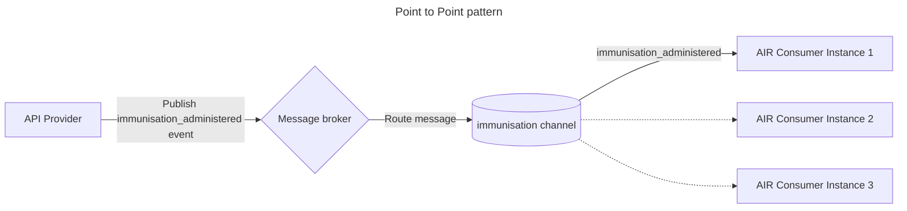

## Point to point

The point-to-point message exchange pattern is used to deliver the message to a **single** consumer in what’s called a "one-to-one" exchange. The messages are put onto a queue and consumers consume the messages, before acknowledging them as consumed where they are removed from the queue. If there is more than one consumer, they each read messages from the queue. If more consumers are added, the queue is processed faster.

This pattern can be advantageous when designing resilient consumers, for example, one consuming application may maintain two instances for high availability. While both instances are connected to the single channel, they become "competing consumers", where only one will process the message. This enables a level of resilience without the two instances needing to know whether or not the other instances are online and processing messages, meaning there is reduced coupling between independent instances.

The below is a fictional example of a Point to Point channel.

<DetailedDescription text="In the diagram, there is an API Provider, a message broker, and an API Consumer. The API Provider publishes an immunisation_administered event to the message broker, and the message broker then routes the event to the API Consumer."/>

In this example, one consuming system, AIR, is consuming `immunisation_administered` events from multiple brokers. The immunisation_administered event is only processed by one broker (one consumer).

### When to use this pattern

- When there is a requirement for high concurrency of messaging processing, as the processing workload can be scaled
- When there is only going to be a single consumer of a message
  - If more than one consumer is required, multiple queues can be added
