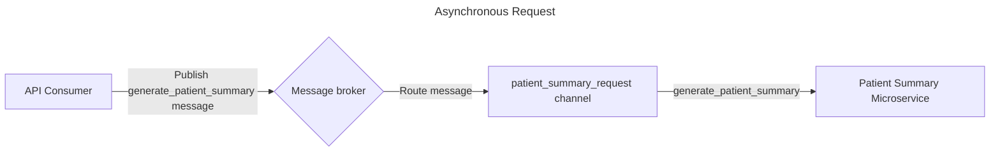
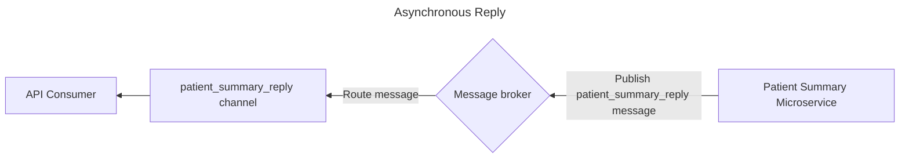

## Asynchronous Request-Reply

The Asynchronous Request-Reply pattern is typically used in Async APIs which are using "Command messages" - messages which specify a function or method that the message sender wants to invoke. When a command message is sent, it often expects a response with a result, or confirmation that the message has been processed.

Example Asynchronous Request-Reply interaction:

In the above example, there are two message channels, one for requesting a Patient summary, and one to receive Patient summary response messages. Although this workflow is similar to a typical REST API interaction, an Asynchronous Request/Reply may be more appropriate if the process of generating a Patient summary may take a long amount of time (perhaps due to complex orchestration of data sources). Rather than the API Consumer waiting for the response, they are able to continue and instead receive messages from the reply channel when the summary is ready.

### When to use this pattern

- When an API is performing logic or calculations which may take longer than the duration of an HTTP request
- When an API is performing intense logic that may not scale well
- When a downstream service is subject to rate limits, so message processing concurrency may be limited
