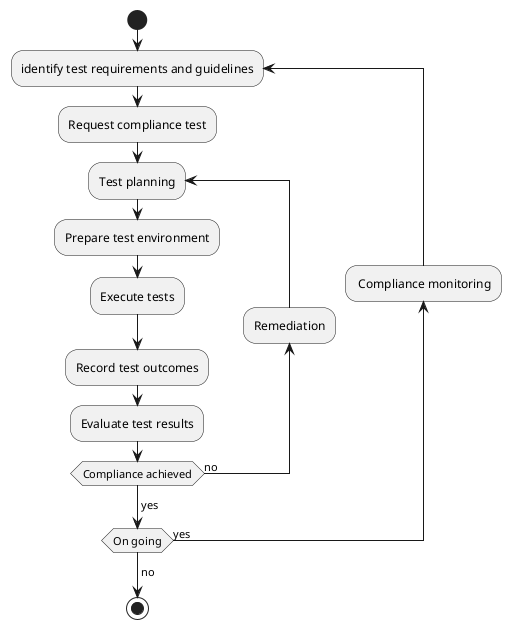

## What is Compliance Testing 

Compliance testing is a software testing that checks whether an API Consumer's system, product, or software application, adheres to specified standards, protocols, or regulations. Compliance testing helps to validate that an API Consumer application aligns with a predetermined set of rules and guidelines imposed by API Provider, enhancing overall quality, eligibility, reliability, and interoperability. 

## Purpose 

The goal of compliance testing is to ensure that the API consumer application meets the compliance requirements, technical specifications, and legal regulations imposed by API Provider. 

### Key Benefits of Compliance Testing: 

**Legal and regulatory adherence**: Ensures that the product or system complies with laws and regulations to avoid legal penalties. 

**API Provider and API Consumer confidence**: Demonstrates that API consumption meets compliance requirements, which can help build confidence with API Providers, API Consumers and stakeholders.

**Risk mitigation**: Identifies risks and vulnerabilities early in the development process, minimising the chances of security breaches, data leaks, privacy violations, or regulatory issues. 

**Improved quality**: Enhances the overall services quality, security, and performance; improves data quality and data integrity by embedding the quality requirements into design and assurance process.

## Key Considerations of Compliance Testing
API Providers should take the following key considerations into account when designing the compliance test:

- Align Compliance Testing to business use cases. This will help API consumers complete the compliance tests relevant to them

- Provide clear instructions for executing tests and success criteria. [Gherkin syntax](https://cucumber.io/docs/gherkin/reference/)) provides a useful framework for structuring tests

- Provide information of mandatory tests and conditions (e.g. a test is only required to complete if API Consumer has permission to view a patient's contact details)

- Provide example or test data where feasible 

- Address the **SPICE** concerns:
    - **S**ecurity - For example,  Given the user is authenticated
    And the user does not have permission to view sensitive information
    When the user attempts to access the sensitive information
    Then the sensitive information should not be displayed to the user
    - **P**rivacy - For example, [AsyncAPI Consumer](./04-AsyncAPI.md) discard the irrelevant events 
    - **I**dentity - For example, API Consumer uses MFA to authenticate service users 
    - **C**linical Safety - For example, the Patient immunisation information must be displayed in full regardless the screen resolution
    - **E**quity - For example, Given the API returns data with macrons
    When the user views the data containing macrons
    Then the macron characters should render properly across all supported devices and platforms

- Tests should reflect real life scenarios

- Automate testing where it can

- Tests can be extended with additional tests with incremental development 

- Tests are reliable, repeatable, and traceable

- Edge cases are considered (e.g. long names of patients, medicines, etc.) 

- Remediation path is provided for test failure  

- Recertification process is defined for periodic compliance testing and change of compliance status 

- Provide examples and environment to demonstrate compliance (e.g. a compliance demo)

- Provide test report or summary template  

- Consider alternative or innovative tools to ease the compliance testing process, e.g. recorded demo, automation, report generation, etc. 

## Compliance testing process 

*API Provider* **MUST** provide compliant testing process definition. Diagrams **SHOULD** be used that describe an API Consumer compliance testing journey. 
 
The process of compliance testing involves several steps to verify that the system meets the required compliance. Below is how a typical compliance test process looks like:

A Compliance Testing Process should cover the following steps:

1. Identify Test Requirements and Guidelines 

    - Identify the compliance requirements (e.g. NHI Compliance Test requirements) that the API Consumer must comply with.
    - Gather documentation: Collect and review the relevant guidelines, technical specifications, or examples. 
    - Define criteria: Clarify the specific requirements that need to be tested, such as functional behaviour, security, data integrity, etc.

1. Request Compliance Test
    - API Consumer SHOULD request compliance test

1. Test Planning 
    - Create a test plan
    - Define tooling
    - Allocate resources 

1. Prepare Test Environment 
    - Set up the controlled test environment 
    - Configure the test environment to capture the necessary data
    - The test environment should reflect realistic usage conditions to validate the system’s compliance in expected operational scenarios 

1. Execute Tests 
    - Run compliance tests
    - Use a combination of automated and manual tests but automate when possible

1. Record Test Outcomes
    - Document the results of each test case against the compliance criteria. 

1. Evaluate Test Results 
    - Review and assess the test result
    - Identify gaps or issues: document the non-compliant areas if any and analyse the root cause. 
    - Generate reports: Summarise compliance status, any failures, and suggestions for remediation. 

1. Remediation (if necessary)
    - Fix the identified non-compliance issues 
    - Re-test after corrections: After fixes have been implemented, re-run the necessary tests to ensure compliance. 

    - Iterate until compliance is achieved: Repeat the process of fixing and testing until all compliance requirements are met. 

1. Ongoing Compliance Monitoring (if necessary)
    API Provider can require continuous monitoring or periodic reassessment to ensure ongoing compliance. When compliance requirements are changed, ensure that the API Consumer undergoes updated compliance testing.

## Examples 

- Get Match And Validate Patient Compliance Testing
    https://master.d3b08qop7whnnl.amplifyapp.com/GetMatchAndValidatePatientComplianceTesting.html 
