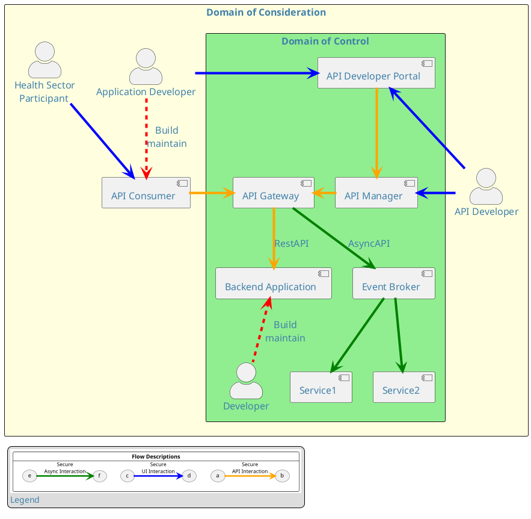

:::warning[Status]
Content is draft and in review – this content may change until review is complete and formally published.
:::

## Introduction to API Security

According to [Gartner](https://www.gartner.com/en), API abuses are one of the most-frequent attack vectors
for enterprise web application data breaches. As such, securing RESTful APIs is
fundamental to the success of any API Strategy or implementation; any approach
should include the following three key
areas:

- Domain of Consideration
- Domain of Control
- Identity[^1]-centric and Holistic View

### Domain of Consideration

Developing and securing RESTful APIs is more than just applying
standards; it is a framework and state of mind that has to be understood
and followed jointly by the API Providers and API Consumers. The API Security framework must be defined at the
organisation and business level and should always consider who, how and
what health consumers and applications (both internal and external to an
organisation) will interact with the APIs. These considerations should
be defined at the beginning of any project and driven from a desired
business outcome e.g. provide real time information for the public about
the closest location and address of a GP.

<DetailedDescription text="This diagram illustrates the interactions between three actors: Application Developer, API Developer, and Health Sector Participant. These actors collaborate within the Domain of Consideration, which encompasses the overall healthcare ecosystem. Domain of Control: Within the Domain of Control, various components facilitate API development, management, and consumption. These components include: API Consumer (AC): The end-user of the APIs, represented by the mobile device in the diagram. API Developer Portal: A user-friendly interface for API developers to create and manage APIs. API Manager: A tool for configuring and deploying APIs, ensuring secure and reliable access. API Gateway: An intermediary between API consumers and backend applications, routing requests and enforcing access control. Backend Application: Houses the business logic and data for the APIs, providing the core functionality. Event Broker: Handles real-time communication between components, enabling asynchronous interactions. Service1 and Service2: Represent additional services that may be integrated with the API ecosystem.Interactions: The diagram depicts the interactions between the actors and components: Application Developer: Interacts with the API Developer Portal to access API documentation and resources. API Developer: Collaborates with both the API Developer Portal and API Manager to create, configure, and deploy APIs. Health Sector participant: Utilizes the API Consumer (AC) to access and utilize the healthcare APIs. Flow Descriptions: The diagram highlights three primary flow descriptions: Secure API Interaction: Represented by the orange arrow, this flow depicts secure communication between API consumers and backend applications through the API Gateway. Secure UI Interaction: Represented by the blue arrow, this flow illustrates secure communication between API developers and the API Manager through the API Developer Portal. Secure Async Interaction: Represented by the green arrow, this flow demonstrates secure asynchronous communication between components facilitated by the Event Broker."/>

### Domain of Control

The Domain of Control contains the components (defined further in this
document) that need to be developed, deployed and work
together to provide API security to support:

- Registered application developer access to the API
- Authenticated and authorised consuming application access to the API
  or Events
- Protected communication between the API, the Event Broker and the
  consuming application to ensure confidentiality and integrity
- The ability for applications to act on behalf of a health consumer

## Identity Centric and Holistic View

The security of APIs should not just be seen as a bounded solution i.e.
only the components illustrated in security considerations above, but
needs to be seen from a holistic perspective. It needs to incorporate
existing enterprise security frameworks where the management and
understanding of user identities is core. For example, securing an API
that is targeted for a mobile application is not just about applying an
OAuth profile, it should take into consideration how mobile devices and
applications are managed and secured and how the enterprise security
framework (e.g. authentication) can be leveraged.

<DetailedDescription text="The diagram is a Venn diagram with 3 intersecting circles representing: mobile and application security, API security and enterprise security.
These intersect in the middle representing identity, which is central to an API security framework."/>

## Definitions

This version of the API Standard has the main focus on REST but GraphQL and AsyncAPI specifications are included
under the banner of APIs.

These additional types of API are covered in [API Design](../api-development/API%20Design)
but from a high-level perspective the definitions below apply to all
four API types.

For a glossary of terms used in this standard see [Glossary](../Glossary)

:::info
A health consumer/user can be internal or external to Te Whatu Ora - Health New Zealand.
:::

[^1]: Identity relates to how a person (or thing) is represented and how this is used to access services or information. See  [What is Digital Identity](https://www.digital.govt.nz/digital-government/programmes-and-projects/digital-identity-programme/what-is-digital-identity/)
