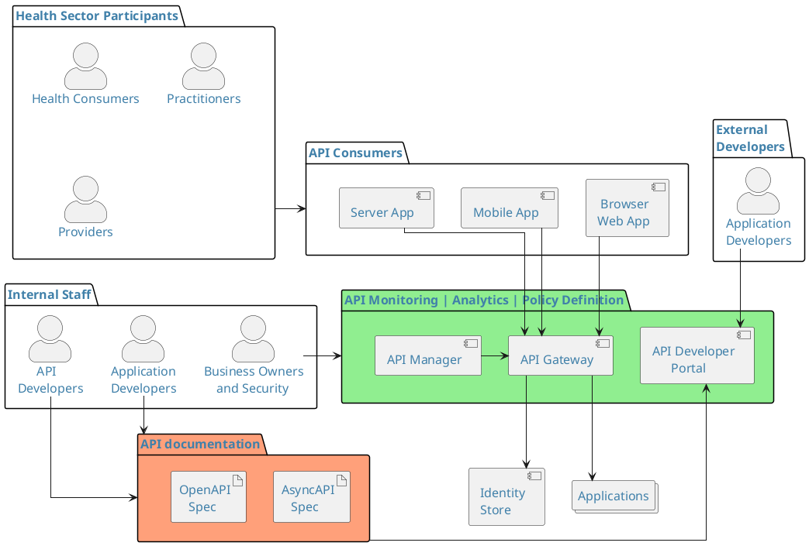
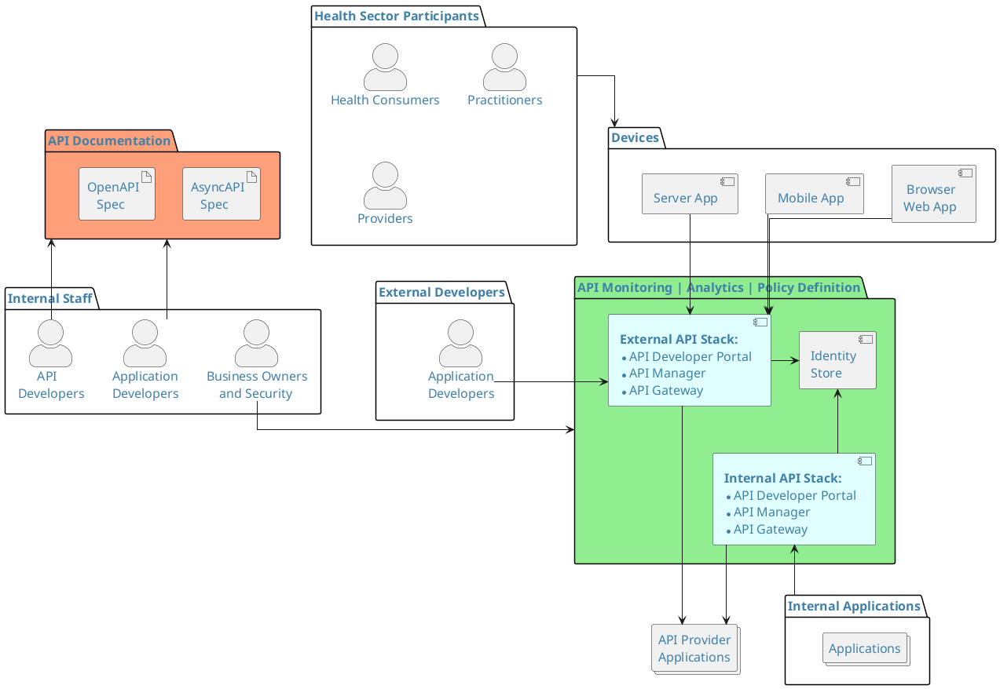

:::warning[Status]
Content is draft and in review – this content may change until review is complete and formally published.
:::

This section describes an API Security Reference Architecture and its
component parts to inform the construction of an API security
framework.

It is important to note that FHIR, REST, GraphQL and AsyncAPI are
different architectural models for building synchronous and
asynchronous APIs that can leverage the Security Controls (e.g. OAuth
2.0 and OpenID Connect) defined in this document; but they all have
their own intrinsic security models (e.g. throttling consideration in
GraphQL) that are not covered in this document.

## Actors and Security Functional Capabilities

Identity and Access Management defines the actors (users and devices)
who interact with system components that manage and expose APIs.
The diagram below shows a typical model of API components (support stack) and
actors.

<DetailedDescription text="The diagram captures the interactions between various actors, components, and artifacts within the healthcare ecosystem, emphasising the roles of API developers, API managers, and API consumers. It also highlights the importance of secure interactions, API documentation, and identity management in enabling seamless API usage. The diagram is divided into several packages, each representing a distinct area of focus within the healthcare ecosystem. These packages include: Health Sector Participants (HSP): Encapsulates the key actors within the healthcare system, namely Health Consumers, Practitioners, and Providers. API Consumers: Represents the various devices used to access and interact with the healthcare system, including Browser-based Web Apps, Mobile Apps, and Server Apps. API Monitoring, API Analytics, API Policy Definition (AAPD): Encompasses the tools and functionalities for managing and governing APIs, including API Developer Portal, API Manager, and API Gateway. API Documentation (APID): API specifications for developers including AsyncAPI Spec and OpenAPI Spec. Internal Staff: Represents the internal personnel involved in the development and management of the healthcare system, including Application Developers, API Developers, and Business Owners and Security. External Developers: Encapsulates external application developers who may utilise the healthcare system's APIs. Key Relationships: The diagram illustrates several significant relationships between the various components: Device Interaction with API Gateway: API Consumers, including Browser-based Web Apps, Mobile Apps, and Server Apps, communicate with the API Gateway to access and utilise the healthcare system's APIs. API Developer Portal and API Documentation Access: Application Developers and API Developers interact with the API Developer Portal to access and utilise API documentation, such as AsyncAPI Spec and OpenAPI Spec. API Management and Governance: The API Developer Portal, API Manager, and API Gateway work together to manage, govern, and secure the healthcare system's APIs. Identity Management: The Identity Store serves as a central repository for managing user identities and access permissions, ensuring secure access to the healthcare system's resources. API Consumption: External Application Developers can access and utilise the healthcare system's APIs through the API Developer Portal and API Gateway. Additional Elements: Collections: The Applications collection represents the various applications that utilise the healthcare system's APIs. Artifact: The OpenAPI Spec artifact highlights the importance of OpenAPI Specification in defining the structure and behavior of the APIs."/>

The components defined remain valid no matter what API architecture
(internal, cloud, hybrid) is implemented.

See [Standards Component Definitions](../api-concepts/ComponentDefinitions) for details of the various components illustrated above.

The core components of an API Security Framework (the developer
portal, manager and gateway) provide a grouping of functionality.
These functions can be delivered with discrete applications, or
bespoke code development, via COTS products or through leveraging
existing devices that can be configured to provide these functions /
services. Note: some of the functionality may overlap or be combined
into one or more products depending on the vendor used.

The following lists the functions of a mature API delivery and
security framework for an agency that is working with the development
community. Together, these functions provide full support for the
application developer building and developing consuming applications
that will use the API(s) exposed by the agency.

Depending on the requirements of the agency, some of these functions
might not be required e.g. if the agency API exposed is purely for
public consumption and only allows consuming applications to read
information, then only a solution for enforcing threat protection
(i.e. Denial of Service) might be required, and this could be
delivered using an existing service protection capability.

<table>
<colgroup>
<col  />
<col  />
</colgroup>
<thead>
<tr class="header">
<th colSpan="2">Core Components</th>
</tr>
</thead>
<tbody>
<tr class="odd">
<td>API Portal</td>

The API Portal often provides the following functions for internal and external application developers:

<ul>
<li>
Discovery of APIs
</li>
<li>
Analytics to monitor APIs
</li>
<li>
Access to specifications and descriptions of APIs, including
SLAs
</li>
<li>
Social network capability to share and publish ideas
</li>
</ul>

Also supports the development, build and test of consuming applications.

</tr>
<tr class="even">
<td>API Manager</td>

The API Manager functions cover:

<ul>
<li>
Centralised API administration and governance for API
catalogues
</li>
<li>
Management of registration and on-boarding processes for
communities of API developers
</li>
<li>
Lifecycle Management of APIs
</li>
<li>
Applying pre-defined security profiles
</li>
<li>
Security policy administration / definition
</li>
<li>
Policy evaluation
</li>
</ul>
</tr>
<tr class="odd">
<td>API Gateway</td>

The API Gateway capability can provide the following:

<ul>
<li>
Act as the API proxy or the host acting as the primary point of
access for exposed APIs
</li>
<li>
Enforce threat protection, throttling and quota
management
</li>
<li>
Authorisation Services to control access to APIs
</li>
<li>
Authentication Services to ensure only permitted users
(internal/external) have access to the API
</li>
<li>
Security Policy enforcement
</li>
<li>
Monitoring and analytics for business and security
analysts
</li>
</ul>
</tr>
<tr class="even">
<td>Event Broker</td>
<td>
The Event Broker (or "broker") is responsible for receiving
events (aka messages) from publishers (services) and delivering them to
subscribers (services), that is, the consumers who have registered
interest in events of that type.

Brokers often store events until they are delivered, which is what
makes event driven architectures very resilient to failures. Examples of
brokers are RabbitMQ, Apache Kafka and Solace.

With the emergence of an AsyncAPI standard, event driven
architectures are becoming more prevalent.
</td>
</tr>
<tr class="odd">
<td>API Documentation</td>
<td>
OpenAPI (REST APIs) and AsyncAPI are API (message and event-based
APIs) documentation specifications in a machine-readable format

<a
href="https://github.com/asyncapi/bindings"><u>https://github.com/asyncapi/bindings</u></a>
</td>
</tr>
<tr class="even">
<td>API Monitoring and Analytics</td>

Business owners and security specialists need to be able to
monitor the use of APIs:

<ul>
<li>
Monitor uptake of API services
</li>
<li>
Define when to deprecate an old version
</li>
<li>
Profile usage for business
</li>
<li>
Profile usage for security baselines
</li>
<li>
Detect and respond to security events (SEIM)
</li>
</ul>

This helps adapt to change in usage/demand.

</tr>
<tr class="odd">
<td>Credential Stores</td>

The credential stores are identity and key stores which are used
to securely store:

<ul>
<li>
Internal and external user objects, and possibly groups
</li>
<li>
API keys and secrets, certificates etc.
</li>
</ul>

These stores are used by the API Gateway for authorisation and
authentication services

</tr>
</tbody>
</table>

The model can also be split, with the API support stack duplicated –
one set to support internal API usage and one set to support external
use:

Authentication, authorisation, confidentiality, integrity and
availability can be applied across the components in the support
stack, depending on component capabilities.

The actual configuration and location of the API functional
capabilities will vary depending on individual circumstances (e.g.
some capabilities may be internal, some may be in the cloud, where API
development is outsourced then ‘internal’ functional stack may belong
to the outsourcer etc.). Also, some components might not be required
or can be developed in house.
