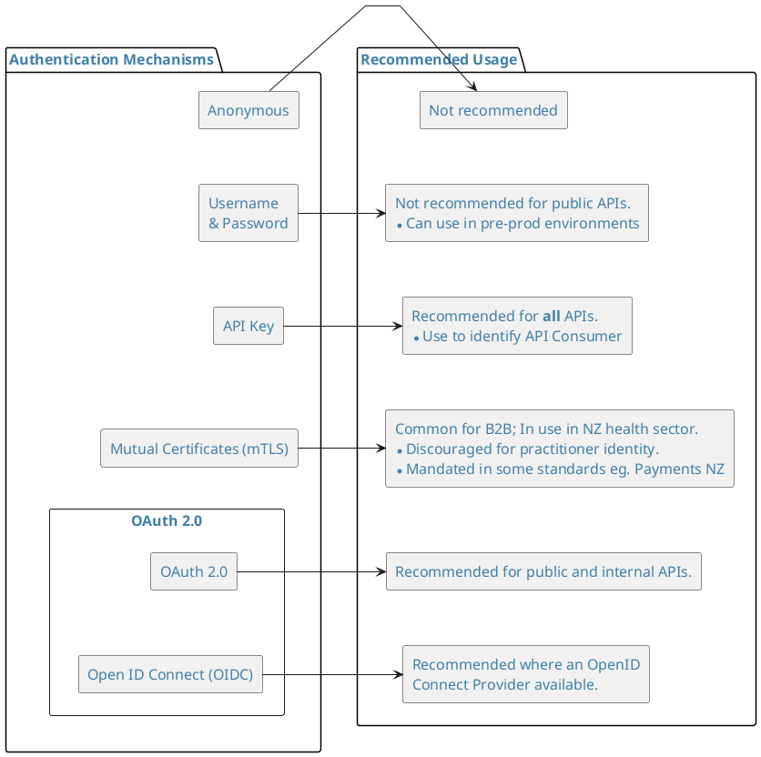
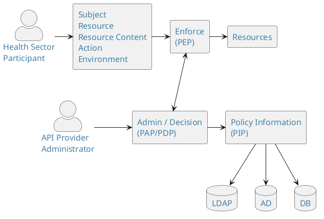
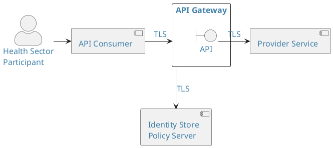
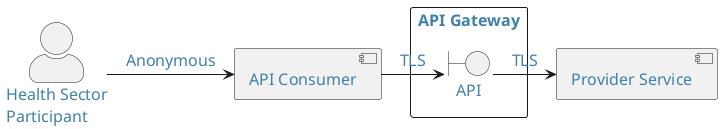
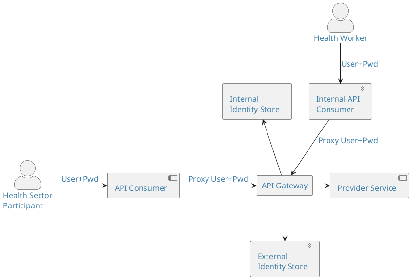
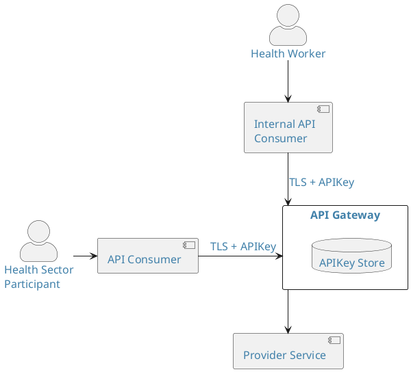
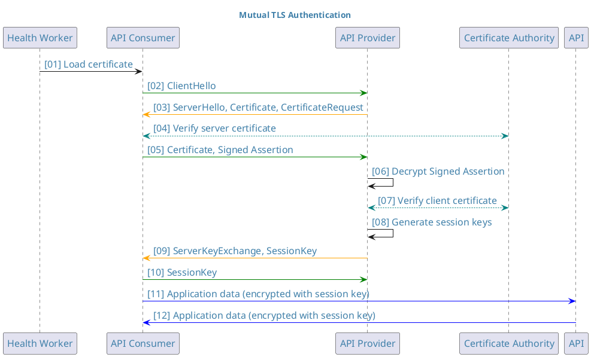

Before looking at the technical solutions to API authentication and
authorisation, this section will provide an introduction that
illustrates some of the situations where authentication and authorisation are
appropriate.

Authorisation and authentication are intrinsically linked inside the
OAuth 2.0 framework which in itself is regarded as synonymous with
securing APIs. OAuth 2.0 uses its own terminology which is worth
becoming familiar with when adopting an OAuth 2.0 approach.

As the OAuth 2.0 framework is a commonly accepted approach to
securing modern APIs this section provides a high level introduction to OAuth 2.0.

## Authentication

<ApiStandard id="HNZAS_MUST_AUTHENTICATE_API_CONSUMERS" type="MUST" toolTip="Consumers of APIs must be authenticated to access resources." >**Appropriate authentication MUST be achieved when accessing APIs**</ApiStandard>

When securing APIs, authentication is required to identify the [health sector participants](../../api-concepts/ComponentDefinitions#health-sector-participants)
and/or [API Consumers](../../api-concepts/ComponentDefinitions#api-consumer) that want to access or use an API.
Authentication enables the [API Provider](../../api-concepts/ComponentDefinitions#api-provider) to identify all consumers of an
API and to confirm that the consumer requesting access is who they say
they are. This doesn’t automatically authorise them to access the APIs
or the underlying resources.

Providers should define a registration process for each category of
API consumer or health sector participant.

The ability to understand who or what is using an API cannot be overstated. This is
critical when it comes time to implement aspects of the API
lifecycle, such as deprecation, or notification of an outage. It
also enables the API provider to implement different service levels for
different consumers. E.g. commercial customers might have a higher
request limit per day than customers not paying for the use of the API.

Ensuring application developers register for use of the API also means
they must sign up to terms and conditions that define how they might use
the data they get from the API, and that they agree to ensure that their
API consumer(s) will behave in an acceptable and non-abusive manner that
preserves the privacy of the information owner.

### Authentication Mechanisms

The diagram below identifies mechanisms and recommended usage for API security.

<DetailedDescription text="This diagram presents a classification of various authentication mechanisms with recommendations for their usage. It is organised in two main sections: 1. Usage: Not Recommended: This section includes two boxes: Not Recommended: This indicates mechanisms not recommended for general use. Not recommended for public facing APIs: This specifies mechanisms unsuitable for APIs accessible to the public. Recommended: This section includes four boxes, each with specific contexts and strengths: Recommended for all APIs: This highlights mechanisms suitable for most APIs. Usually B2B although common in the Health Sector: This identifies mechanisms typically used in B2B environments, but also prevalent in healthcare. Recommended for internal and external APIs: This suggests mechanisms suitable for both internal and external APIs. Recommended where an OpenID Connect Provider is available: This proposes mechanisms that leverage OpenID Connect when available. 2. Authentication Mechanisms: Anonymous: This mechanism allows users access without providing any credentials. Username and Password: This traditional method relies on users providing a username and password. API Key: This method uses unique API keys assigned to authorised users. Certificates (mTLS): This approach uses digital certificates for mutual authentication between the client and server. OAUTH: This section further details OAuth mechanisms: OAuth2: This is a widely used authorisation framework granting access tokens based on user consent. Open ID Connect (OIDC): This protocol builds upon OAuth2, providing user identity information along with access tokens. Right-pointing arrows: These arrows indicate recommended transitions between usage categories. Overall Interpretation: The diagram recommends using strong authentication mechanisms like OAuth2 and OIDC for most APIs, especially public-facing ones. For internal APIs or those not requiring high security, username and passwords or API keys might be acceptable. Anonymous access and mTLS certificates are considered less common scenarios."/>

<!--  -->

<!--
There is a second Security Token option that is built on SAML, but it
is only recommended if SAML is already in place within a particular
sector (For example Education), otherwise SAML is seen as a deprecated
model for REST APIs.
This document does not cover the SAML option but the following link
detail how SAML is used as an authentication token in OAuth 2:
<u>Security Assertion Mark-up Language (SAML) 2.0 Profile for OAuth
2.0 Client Authentication and Authorization Grants</u>
-->

## Authorisation

<ApiStandard id="HNZAS_MUST_USE_APPROPRIATE_AUTHORISATION" type="MUST" toolTip="Appropriate authorisation must be applied to control access to resources." >**Appropriate authorisation MUST be applied**</ApiStandard>

Authorisation is the act of performing access control on a resource.
Authorisation covers both the definition of access controls and the enforcement of those controls.
 This includes the access
rules and policies, which should define the required level of access
agreeable to both provider and consuming application. The foundation
of access control is a provider granting or denying a consuming
application and/or consumer access to a resource to a certain level of
granularity.

In the Authentication section the concepts of OAuth 2.0 were introduced,
and a number of Authentication patterns were defined. This section
focuses on Authorisation and provides additional patterns that work
with OAuth 2.0 or provides an alternative.

Authentication on its own does not necessarily provide permissions to
access an API or application. It merely validates that you are who you
say you are. If it is used for access control, it is an all or nothing
control mechanism.

Once a user is authenticated (e.g. using username and password), an
authorisation process will grant (or deny) them the right to perform
an action or access to information. Normally this authorisation
process is applied using either a coarse grained or fine-grained
access control process.

The normal model is to provide coarse grained access at the API or API
Gateway request point, and fine-grained control at the API Provider service implementation.

### Role Based Access Controls (RBAC)

<ApiStandard id="HNZAS_SHOULD_USE_RBAC" type="SHOULD" toolTip="Role Based Access Controls (RBAC) should be used." >**RBAC SHOULD be used**</ApiStandard>

In many organisations a Directory service provides authentication
for users. Directory groups are then used to provide
authorisation. This is classed as Discretionary Access Control (DAC):
access to systems is granted by applying Access Control Lists (ACLs)
directly to the user, or to the groups in which users reside.

Directory (or LDAP) Groups are synonymous with roles and can be
used to provide coarse-grained authorisation for APIs.

### Scopes (Limited Fine Grain Access)

<ApiStandard id="HNZAS_MUST_INCLUDE_SCOPES_IN_ACCESS_TOKENS" type="MUST" toolTip="Appropriate scopes must be present in access tokens when accessing APIs." >**Appropriate scopes MUST be present in access tokens when accessing APIs**</ApiStandard>

Based on the services (APIs) that are exposed, additional access
controls can be applied using scopes. For example, a data service
might provide `read` and `write` scopes which could be granted to a
user based on the directory groups they were in.

<ApiStandard id="HNZAS_MAY_USE_OAUTH2_SCOPES_FOR_RBAC" type="MAY" toolTip="OAuth 2.0 Scopes may be used to limit the authorisation granted to the
API consumer by the resource owner.">[OAuth 2.0 Scopes](https://datatracker.ietf.org/doc/html/rfc6749#section-3.3) **MAY** be used to limit the authorisation granted to the
API consumer by the resource owner. </ApiStandard> The developer
has to ensure that the minimum privileges are granted to API consumers to carry out the API requests that the user wishes the API consumer to complete.

Scopes provide a level of coarse/fine grained access and represent
specific access rights e.g. the ability to read a resource or write a
new resource (or both) is limited by the `scope` of the Access Token.

Scopes can be used alone to define coarse/fine grained access. Consideration is needed to understand (for example)
if:

- a single scope protects the service

- scopes are defined to protect fine-grained business functionality

- services should be divided into many smaller services with one scope each

Once a token is issued to an API consumer, the access rights
bound by the scope are encapsulated in the Access Token for the length
of its validation period.

An API consumer may invite a user to authorise the application to
act on behalf of the health sector participant. <ApiStandard id="HNZAS_MUST_PROVIDE_INTENT_TO_AUTH_SERVER" type="MUST" toolTip="API consumers must provide request intent to authorisations servers." > In order for this to occur the
the API consumer **MUST** provide the authorisation server with the `intent` of it's
request.</ApiStandard>

:::note[My Health Record Screenshot]

:::

### Heart Working Group

<ApiStandard id="HNZAS_MAY_UTILIZE_HEART_WORKING_GROUP_SPECS" type="MAY" toolTip="API Providers may utilise Heart Working Group specifications." >API Providers **MAY** utilise Heart Working Group specifications.</ApiStandard>

The OpenID Foundation uses [working groups](https://openid.net/wg/) to focus on
specific problems, technology or specific marketplace sectors like
FAPI (Financial-Grade APIs) or the Health sector HEART Working group.

[HEART (Health Relationship Trust)](https://openid.net/wg/heart/)
defines a set of profiles that enable patients to control how, when,
and with whom their clinical data is shared.

It also defines the interoperable process for systems to exchange
patient-authorised healthcare data consistent with open standards,
specifically FHIR (Fast Healthcare Interoperability Resources), OAuth 2.0,
OpenID Connect, and UMA (User-Managed Access).

Two pertinent specifications are:

[**Health Relationship Trust Profile for User-Managed Access 2.0**](https://openid.net/specs/openid-heart-uma2-1_0.html) and

[**Health Relationship Trust Profile for Fast Healthcare Interoperability Resources (FHIR) UMA 2 Resources**](https://openid.net/specs/openid-heart-fhir-uma2-1_0.html)

## Attribute Based Access Controls (ABAC)

<ApiStandard id="HNZAS_MAY_UTILIZE_ABAC" type="MAY" toolTip="API Providers may utilise ABAC." >API Providers **MAY** utilise ABAC.</ApiStandard>

Attribute-based access control (ABAC) defines an access control
process whereby access is granted based on policies that are built
using attributes e.g. a policy might state that access to a specified
resource is only permitted for users who are in Sales or Marketing,
who are managers, during office hours only. ABAC provides fine grain
authorisation services.

The really important control that ABAC provides is the ability to
provide context when applying access controls, e.g. access decisions
can be based on the IP address of the device, the operating system of
the client and the last known transactions of a client.

The recognised standard for ABAC is XACML, which is an XML
based-language.

### ABAC Implementation

<ApiStandard id="HNZAS_MAY_IMPLEMENT_ABAC" type="MAY" toolTip="API Providers may implement ABAC." >API Providers **MAY** implement ABAC.</ApiStandard>

To implement Attribute Based Access Control, the current models defined
use XACML.

XACML (developed by OASIS), provides a reference architecture, a request
/ response protocol and a policy language.

It is a highly distributed and loosely coupled architecture. It provides
very useful generic definitions of the required components (services)
which can be used to define any access control model.

It uses the following services to define the reference architecture:

- Policy Enforcement Point (PEP) – where the request to the resource
   is intercepted and policy applied (based on the decision made by the
   Policy Decision Point)

- Policy Decision Point (PDP) – This is the policy server to which the
   PEP sends the request for evaluation as to whether a user should or
   should not have access to a resource. The PDP has access to policy
   and can match the credentials and request against policy to make a
   permit/deny decision. It can also enforce policy related obligations
   e.g. enhanced logging, notification and alerts, or re-routing to
   request additional authorisation process.

- Policy Administration Point (PAP) – The interface where the policies
   are developed and defined

- Policy Information Point (PIP) – Used to gather additional
   information about a user from Identity stores or databases to
   provide additional attributes that are required by the PDP to
   validate the policy and apply the required outcome.

The links and flows between these services are detailed in the diagram
below:

<DetailedDescription text="This diagram depicts a system with a focus on access control for health sector participants accessing resources through an API. A breakdown of its interactions: Health Sector Participants (HSPs) access resources through an API. API Provider controls access by enforcing policies. Policies are stored and retrieved from a central Policy Information Point (PIP). Decisions to grant or deny access are made by the Admin/Decision (PAP/PDP) based on policies and user attributes. External databases store user and resource attributes used for authorisation. The system ensures secure access control for health sector resources."/>

XACML is generally perceived as being difficult to write policies in,
but this is being addressed in two ways:

- OASIS is developing a Request/Response Interface based on JSON and
   HTTP for XACML 3.0, Version 1.0

- There is a JSON-based language called ALFA (Abbreviated Language for
   Authorization) which can be used to build XACML policies

## API Gateway

<ApiStandard id="HNZAS_MAY_IMPLEMENT_API_GATEWAYS" type="MAY" toolTip="API Providers may implement API Gateways." >API Providers **MAY** implement API Gateway technology.</ApiStandard>

API Gateways have been mentioned previously in the context of API
protection. Most API Gateways on the market provide support for OAuth
2.0 and can also provide Authorisation (and Authentication) Services
via a direct connection to:

- An Identity Store containing groups

- An Identity Access Management system

- A Policy server

<DetailedDescription text="This diagram depicts a simplified system for health sector participants accessing resources through an API. Here's a breakdown: Health sector participants access resources through an API using a secure client app. The API Gateway handles initial requests and communicates securely with an Identity & Policy Server. The server verifies identities, enforces policies, and forwards authorised requests to the Provider Service. The Service then fulfills the request and returns the desired resource (if allowed). Secure TLS connections ensure secure communication throughout the process."/>

## Anonymous Authentication

<ApiStandard id="HNZAS_SHOULD_NOT_USE_ANONYMOUS_AUTH" type="SHOULD NOT" toolTip="Publishers should not use anonymous authentication for APIs." >**SHOULD NOT**</ApiStandard>

This is where the health sector participant and the API consumer they are using can gain
access to APIs without needing to authenticate in any way.

<DetailedDescription text="This diagram depicts a simplified system where health sector participants can access resources through an API without requiring authentication. Here's a breakdown: Health sector participants can access resources directly through an API without authenticating. A secure (TLS) connection is used between the client app and the API gateway. The API gateway directly forwards requests to the provider service, bypassing any authentication checks. This setup allows anyone to access resources, potentially posing security risks."/>

<ApiStandard id="HNZAS_MAY_USE_ANONYMOUS_AUTH_IF_NEGLIGIBLE_RISK" type="MAY" toolTip="Negligible risk (e.g. publicly available data) resources may use anonymous authentication." >This approach **MAY** be used when the risk associated with the API is
negligible e.g. an API offering publicly available information.</ApiStandard>

The downside of this model is that it makes it difficult to gather
effective analytics, and therefore to understand the implications of
proposed changes to, and deprecation of, an API.

<ApiStandard id="HNZAS_MUST_IMPLEMENT_VULNERABILITY_PROTECTION_FOR_ANON_AUTH" type="MUST" toolTip="When using anonymous authentication providers must implement appropriate vulnerabiity protection." >If using the Anonymous authentication model the API **MUST** implement appropriate protection against typical API vulnerabilities and threats, as listed on the [OWASP (Open Web Application Security Project)](https://owasp.org/www-project-api-security/) site.</ApiStandard>

Typically, these relate to:

- Throttling to prevent Denial of Service attacks

- Payload, header and query parameter analysis to block HTTP attacks parameter attacks such as
   cross-site scripting (XSS), SQL injection, command injection and cross
   site request forgery (XSRF)

## Username and Password Authentication (Direct Authentication)

<ApiStandard id="HNZAS_SHOULD_NOT_USE_DIRECT_AUTH" type="SHOULD NOT" toolTip="API providers should not use Direct Authentication." >**SHOULD NOT**</ApiStandard>

In the Direct Authentication model, also known as HTTP Basic or Digest Auth, the user is authenticated via an
identity store using username and password credentials over HTTPS.

There are possibly some legacy situations where the API Provider **MAY** implement this pattern for API access however this **MUST** be an exception and be recorded appropriately.

<DetailedDescription text="This diagram depicts a system for managing access to health sector resources through two separate APIs, one for Health Sector Participants (HSPs) and another for Health Workers (HWs). Both access methods involve user authentication and authorisation checks. Here's a breakdown: Two separate APIs cater to Health Sector Participants and Health Workers. Both groups authenticate with their respective API clients, via API Gateway, using username and password. The API Gateway verifies credentials against separate identity stores. Requests are forwarded to the Provider Service for resource access."/>

This model can be easy to implement but has many limitations:

- An identity store (e.g. LDAP) is required along with a full
   registration process for all user types (e.g. applications and
   application developers)

- Cannot leverage a federated authentication model, so no single sign
   on (SSO), requiring re-presentation of username and password at
   every step

- Passwords would be in clear text. If direct authentication is used,
   TLS would be required to secure all communications

- Open to brute force attacks

- Passwords have low entropy, have to be reset and managed, and are
   difficult to revoke at a granular level

This model **MAY** be used for *testing and development* purposes but **SHOULD NOT** be used for production APIs.

## API Key Authentication

<ApiStandard id="HNZAS_SHOULD_USE_API_KEYS_FOR_APP_AUTH" type="SHOULD" toolTip="API keys should be used for application authentication.">**SHOULD**</ApiStandard>

<ApiStandard id="HNZAS_SHOULD_USE_UNIQUE_API_KEYS" type="SHOULD" toolTip="API keys should be unique to a application, developer or organisation.">API Keys are a digital authentication mechanism, with the API key generally being opaque - e.g. a GUID. API keys **SHOULD** be unique and can be assigned to an **application**, **developer**, or **organisation**.</ApiStandard>

The
usual practice is for an application developer to obtain a key for their
API consumer from the API provider and utilise the key within their
API consumer. To obtain an API key, the developer must undergo an
onboarding process with the API Provider.

<DetailedDescription text="This diagram depicts a system for managing access to health sector resources through separate APIs for Health Sector Participants and Health Workers, with a focus on secure authentication using API keys. Here's a breakdown: Separate APIs for Health Participants and Health Workers. Both groups use secure TLS connections and API keys for authentication. The API Gateway verifies API keys against a secure internal Key Store. Only authorised requests are forwarded to the Provider Service for resource access. This system prioritises security and simplifies authentication through API key management."/>

At run time, the API consumer automatically passes the API Key
to the API every time it requests an API resource. The API Gateway
validates the API Key against the API Key Store (which can be part of
the API Gateway functionality or provided by another secure device)
before allowing the API consumer access to the requested API
(or set of APIs) and backend resources.

This model is similar to the Username and Password model, but it is the
API Gateway which can be responsible for creating, managing the API key
and API secret and storing a copy in the API key store for validation,
rather than redirecting to an identity store for policy validation and
approval.

API keys are not linked to users and usually require no cryptographic functions.

<ApiStandard id="HNZAS_MUST_USE_API_KEYS_FOR_SYSTEM_TO_SYSTEM" type="MUST" toolTip="API keys must be used for system to system authentication.">API Keys **MUST** be used wherever system to system authentication is needed (especially with a production level API).</ApiStandard>

They **MAY** be used on their own for simple public APIs which do not need more complex authentication models.

However, the risk is that anyone with a copy of the API key can use it
as though they were the legitimate API consumer. Hence all
communications should be over TLS, to protect the key in transit. The
onus is on the application developer to properly protect their copy of
the API key. If the API key is embedded into the API consumer it **SHOULD** be protected.

:::info
API Keys are recommended as they provide a level of security to
public APIs that can help protect sites from screen scraping or provide
the required information to throttle, or possibly bill, access to data.
Organisations need to carry out a risk analysis of the possible threats
against the classification of the data that could be obtained and from
this decide if API Keys are required.
:::

## Certificates (Mutual) Authentication

<ApiStandard id="HNZAS_MAY_USE_CERT_AUTH" type="MUST" toolTip="API providers MAY use certificate authentication, when the model depends on legacy authentication mechanisms.">**MAY** use this model when the API depends on legacy authentication mechanisms such as [HealthSecure Certificates](https://www.acc.co.nz/health/)</ApiStandard>

In Certificate (Mutual) Authentication both the API consumer and
the API provider hold a digital certificate. The digital certificate can
be trusted because it was issued by a mutually trusted Certificate
Authority (CA) e.g. HealthSecure. When the API consumer makes a request to the
API, the server hosting the API presents its certificate to the
API consumer. The API consumer verifies the server’s certificate then sends its
own certificate to the API provider. The API provider verifies the client
certificate and mutual trust is achieved, allowing the API consumer to use the API.

<DetailedDescription text="This diagram depicts a mutual TLS authentication sequence. Key Actors: Health Worker (HW): Represents the healthcare professional accessing the API. API Consumer (AC): The client application initiating the secure communication. API Provider (AP): The server hosting the protected API resources. Certificate Authority (CA): The trusted entity that issues and validates certificates. Mutual TLS Authentication Process: Certificate Loading: The Health Worker loads their certificate into the API Consumer. ClientHello: The AC initiates the TLS handshake by sending a ClientHello message to the AP. ServerHello, Certificate, CertificateRequest: The AP responds with its certificate, requesting the AC's certificate for mutual authentication. Server Certificate Verification: The AC validates the AP's certificate with the CA. Client Certificate and Signed Assertion: The AC sends its certificate and a signed assertion (likely containing authenticated user information) to the AP. Signed Assertion Handling: The AP decrypts the signed assertion for verification. Client Certificate Verification: The AP validates the AC's certificate with the CA. Session Key Generation: The AP creates symmetric session keys for secure communication. Key Exchange: The AP sends the session keys to the AC. Secure Data Exchange: The AC and AP exchange encrypted application data using the established session keys. Key Highlights: Mutual Authentication: Both the client and server authenticate each other using certificates, ensuring trust. Signed Assertions: Provide additional user information for authorisation and access control. Secure Communication: Session keys protect confidentiality and integrity of exchanged data. Certificate Authority Role: Crucial for establishing trust and verifying identities. Overall, the diagram effectively illustrates the steps involved in establishing a secure communication channel using Mutual TLS authentication, ensuring confidentiality, integrity, and mutual trust between the client and server."/>

## Developer Authentication

<ApiStandard id="HNZAS_MUST_IMPLEMENT_DEV_AUTH" type="MUST" toolTip="API providers MUST implement developer authentication on API portals.">API Providers **MUST** implement Developer Authentication</ApiStandard>

Developer authentication should take place at an API Portal.

An API Portal will offer an authentication solution for developers to
provide a username and password login process.

Once the developer has logged into an API Portal they should be able to browse and
discover the APIs available. API Portals normally require the
consuming application developer to:

- Provide contact details e.g. email address

- Register the application they are developing

The API Portal should provide registration services for the client application to use:

- API keys for basic authentication services and API monitoring

- OAuth 2.0 services and the management of Client ID and a Client Secrets
   (for applications)

- Additional production authentication and authorisation service e.g.
   basic, certificate etc.

:::info
For details on OAuth 2.0 authentication mechanisms see
[Securing APIs with OAuth 2.0 and OpenID Connect](./SecuringAPIswithOAuth2andOpenIDConnect)
