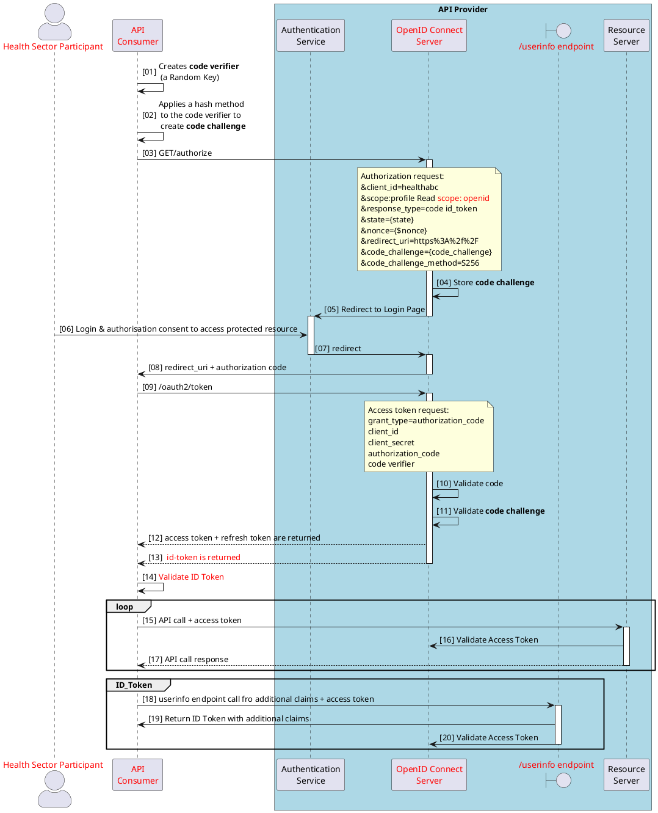
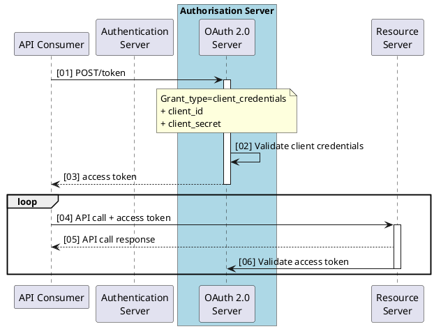
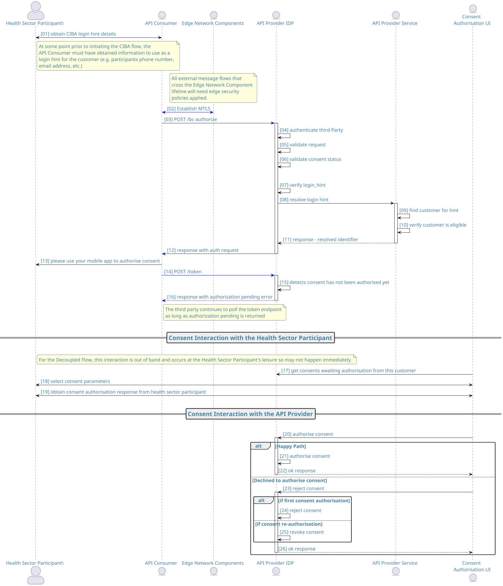

OAuth 2.0 and OpenID Connect are both based on a token-based authorisation framework and are defined and implemented using Grant Flow type patterns. These define the different types of interaction a client application can perform to gain an `access token` and thus access to the protected API.

The grant types define the flow of the different token between the different end points exposed by the API Consumer and API Provider.

## Token Types

Both OAuth 2.0 and OpenID Connect utilise tokens however there are a number of mechanisms used to obtain them. These are sometimes referred to as `grant flows`. Different tokens can be used for different purposes.

|Token Type | Description |Grant Flow Used|
|---|---|---|
|Authorisation Code|Created by the API Provider and sent to the API Consumer after the resource owner has authenticated and provided consent for the required action (e.g. Read) against the data being accessed.<br/><br/>Sent to the API Provider to obtain an Access Token.<br/><br/>**MUST** be protected with TLS and encrypted when stored and **MUST NOT** be stored once it has been used.|[<u>Authorisation Code</u>](https://datatracker.ietf.org/doc/html/rfc6749#page-8)|
| Access Token |Returned to the API Consumer from the API Provider, and then sent to the API Providers resource server when requesting access to a protected resource.<br/><br/>Also called a Bearer token<br/><br/>**MUST** be protected with TLS and encrypted when stored<br/><br/>**SHOULD** have a lifetime less than 60 mins| [<u>Client Credentials</u>](https://datatracker.ietf.org/doc/html/rfc6749#page-9)<br/><br/>[<u>Implicit</u>](https://datatracker.ietf.org/doc/html/rfc6749#page-8)<br/><br/>[<u>Authorisation Code</u>](https://datatracker.ietf.org/doc/html/rfc6749#page-8)|
| Refresh Token | Used to obtain a new Access token (and possibly a new Refresh Token) from the API Provider when the time limit on an issued Access Token has expired.<br/><br/>**MUST** be protected with TLS and encrypted when stored<br/><br/>**MUST** be used when access is granted for a long period of time<br/><br/>If used for Single Page Applications, **MUST** have a lifetime of 24 hours or less|[<u>Implicit</u>](https://datatracker.ietf.org/doc/html/rfc6749#page-8)<br/><br/>[<u>Authorisation Code</u>](https://datatracker.ietf.org/doc/html/rfc6749#page-8)|
| ID Token | Used in all OpenID Connect flows. It is a JWT that is signed and contains meta data that can be used to enhance the level of security during the token exchange(s)<br/><br/>**MUST** be used as a detached signature<br/><br/>**MUST** be signed with an approved algorithm|[<u>Implicit</u>](https://datatracker.ietf.org/doc/html/rfc6749#page-8)<br/><br/>[<u>Authorisation Code</u>](https://datatracker.ietf.org/doc/html/rfc6749#page-8)|
|API Key|A string used in some scenarios to authenticate the client application to the API.<br/><br/>**SHOULD** be 40+ character  random string<br/><br/>**SHOULD** have an associated rotation policy e.g. 6 - 12 month lifecycle| N/A |

## Token Formats

There are three token formats that are used in OAuth 2.0 and OpenID Connect they are detailed in the table below.

|Token Format| Where used |Description | Recommendation / Classification|
|---|---|---|---|
|Opaque Tokens| Authorisation Code<br/>Access Token<br/>Refresh Token | They do not contain any user information, they are a random, unique string of characters that act as a reference for the OAuth 2.0 server to map it to stored information.| **MAY** use with UNCLASSIFIED<br/>**MAY** be used with MEDICAL IN-CONFIDENCE.<br/>If the API provider supports opaque `access tokens` they **MUST** do this in conjunction with the token issuers `/tokeninfo` endpoint.|
|JWT| Access Token<br/>Refresh Token<br/>ID Token |JSON Web Tokens are self contained token and store user identity and access information (claims)|**MAY** use with UNCLASSIFIED<br/>**MAY** be used with MEDICAL IN-CONFIDENCE|
|JWE| Access Token<br/>Refresh Token<br/>ID Token |This is a JWT that has been encrypted using the [JWE standard](https://datatracker.ietf.org/doc/html/rfc7516)|**MAY** use with UNCLASSIFIED<br/>**MAY** be used with MEDICAL IN-CONFIDENCE<br/>**MUST** be used where the token itself contains sensitive information or PHI/PII.|

### Opaque Token

Below is a JSON payload of a response from an OAuth 2.0 Server when they issue an [Opaque] Access Token. As you can see the Access Token itself is a string of characters.

<!-- cspell:disable -->

```json
 {
  "access_token": "sbQZuveFumUDV5R1vVBl6QAGNB8",
  "scope": "Resource.r, Resource.w",
  "token_type": "Bearer",
  "expires_in": 3599
}
```
<!-- cspell:enable -->
Note: The response also contains the lifetime of the access token and the scope(s) approved. Scopes will be covered later but are basically permission that can be performed on the information protected by the API.

### JSON Web Token (JWT)

Below is a JSON payload of a response from an API Provider when they issue a [JWT] Access Token. As you can see the Access Token itself is also a string of characters
<!-- cspell:disable -->
 ```json
{
   "access_token":"eyJhbGciOiJSUzI1NiIsInR5cCI6IkpXVCJ9.eyJzdWIiOiJteUNsaWVudCIsImlzcyI6Imh0…​.",
   "scope":"Resource.r, Resource.w",
   "token_type":"Bearer",
   "expires_in":3599
}
```
<!-- cspell:enable -->
The JWT token is made up of three sections (separated by a period (.):

1. Header - token type, how it is signed and the key identifier
2. Payload - including claims
3. Signature - for validation of the JWT

### JWT Decoded

An example of an encoded JWT is detailed below:

<!-- cspell:disable -->

```json
"eyJhbGciOiJSUzI1NiIsInR5cCI6IkpXVCJ9.eyJzdWIiOiJteUNsaWVudCIsImlzcyI6Imh0dHB
zOi8vaGVhbHRoLmV4YW1wbGUuY29tOjg0NDMvaGVhbHRoL29hdXRoMiIsInRva2VuTmFtZSI6ImFj
Y2Vzc190b2tlbiIsInRva2VuX3R5cGUiOiJCZWFyZXIiLCJhdWQiOiJteUNsaWVudCIsIm5iZiI6M
TUzOTA3NTk2NywiZ3JhbnRfdHlwZSI6ImNvZGUiLCJzY29wZSI6WyJ3cml0ZSJdLCJleHAiOjE1Mz
kwNzk1NjcsImlhdCI6MTUzOTA3NTk2NywiZXhwaXJlc19pbiI6MzYwMCwianRpIjoiRlRRVDZlWmt
EaG02UEhFYVN0aE9Sb1RMQjgwIn0.b2H_BoT988W28s6K-XAU7gsxXoJlBDNZFpeIxb-7a_yXmKnS
0YNw7nxGqYtBL9GMsh6QTXRkohTS\W9bU2cW0hvU1bJp-1XHywn1kNM5JqLNF2YakV3NX-_4WNdn_
Y1n9aRtbAExLIGea6Wlk23zFGWkJ19WQ7vtHvEqy1ho1gwg9-3STvtCp0YlA6wpA9RUlRHwIx_7_l
Aflrhezjm5cmR0BzuxeEoF5BVkxseFXs1l7nRWuXGetwPOYWP1OKm-gZLDhwpXFUhAsa61XAvfc9q
-xaf2deTXlTjUpJso7DiRBdpsdi6KEqvCILp2PBCMkAcOPQUCUOb6jSA_XMSOgzQ"
```
<!-- cspell:enable -->

The JWT is decoded below

```json
{
  "typ": "JWT",
  "alg": "RS256"
}
{
     "sub": "myHealth",
     "iss": "[https://health.example.com:8443/health/oauth]",
     "tokenName": "access_token",
     "token_type": "Bearer",
     "aud": "myClient",
     "nbf": 1539075967,
     "grant_type": "code",
     "scope": [
      "write"
     ],
     "exp": 1539079567,
     "iat": 1539075967,
     "expires_in": 3600,
     "jti": "{Unique Identifier}"
}
[signature]
```

### JWT Benefit Characteristics

The following is a list of why a JWT **SHOULD** be used:

|Characteristic|Description|
|---|---|
|Client Introspection|The token contain self-contained information that can be introspected by the API Consumer and the API Providers Resource Server without having to call the API Provider's Authorisation server therefore improving client performance|
|Identity Claims|Identity claims, expiration time and issuer details are embedded in the JWT, which are used to provide Identity information to the API Consumer.<br/>Claims which can be used to provide granular access controls, enforce the lifetime of the token and validate the issuer and audience of the JWT.|
|Digital Signature|Ensures the integrity and authenticity of the token, preventing tampering of token content and providing a trust framework|
|Standard JWT format| It follows a format defined by an RFC so is compatible across many Vendor solutions|
|Claims Enhancement|A JWT can be enhanced with other claims or metadata and can include claims related to security tags|
|Encryption|The JWT can be encrypted if PII information is included|

## OAuth 2.0 and OpenID Connect Endpoints (API Provider)

There are multiple endpoints that are exposed and secured in the OAuth 2.0 / OpenID Connect architecture. Depending on the grant flow types (covered next) some or all of these end points will be required.

| Endpoint| Location | Tokens | Description |
|---|---|---|---|
| Authorisation End Point<br/>`/authorize`| API Provider | Code_Token<br/>Access_Token<br/>ID_Token | Responsible for redirecting the Resource Owner/Participant to the API Provider Authentication Server so they can login to provide their consent for the client to access a protected resource.<li>**MUST** be protected with TLS</li><li>The API Consumer **MUST** have registered with the API Provider and been allocated a client ID</li><li>PKCE **MUST** be used for any Authorisation code flows</li><li>[PAR](./PARJARMandSessionManagement) **MAY** be used</li><li>[JARM](./PARJARMandSessionManagement) **MAY** be used</li>|
| Token<br/>`/token` | API Provider | Access_Token<br/>Refresh_Token<br/>ID_Token| This authenticates the API Consumer and  based on validation rules and the configuration of the client<li>**SHOULD** be protected with mTLS</li><li>Proof of Possession **SHOULD** be used</li><li>Client_secret_post or client_secret_jwt or private_key_jwt or tls_client_auth **SHOULD** be applied</li>|
|Redirect endpoint| API Consumer | Code_Token<br/>Access_Token<br/>ID_Token | The response from the authorisation endpoint is sent here. This is via HTTP-redirect (302). The API Consumer is responsible for validating tokens from this endpoint.<li>**MUST** be protected with TLS</li><li>PKCE **MUST** be used for any Authorisation code flows</li><li>Redirect Validation **MUST** be carried out</li><li>State and Nonce parameters **MUST** be included</li>|
|Revoke<br/>`/revoke`|API Provider| Access_Token<br/>Refresh_Token| This allows the API Consumer to revoke tokens if required<li>The API Provider **MUST** provide a Revoke endpoint</li><li>MUST be protected with TLS</li><li>Client_secret_post or client_secret_jwt or private_key_jwt<br/> **SHOULD** be used to secure the revoke endpoint</li>|
|Introspect<br/>`/introspect`|API Provider| Access_Token<br/>Refresh_Token | This allows the Resource Server or Client to find out if the token has expired and other details about the token.<li>The API Provider **SHOULD** provide an introspection endpoint</li><li>MUST be protected with TLS</li><li>Client_secret_post or client_secret_jwt or private_key_jwt<br/> **SHOULD** be used to secure the revoke endpoint</li>|
|User Info<br/>`/userinfo`| API Provider| Access Token| Use an access token to get information about the authenticated health participant<li>The API Provider **SHOULD** provide a userinfo endpoint</li><li>**MUST** be protected with TLS</li><li>The Access Token used to authenticate to the endpoint **MUST** be validated for validity (time), Issuer and Signature</li>|
|JSON Web Key URI<br/>`/jwks`|API Provider / API Consumer | |<li>Retrieve the API provider’s public keys to verify issued token signatures</li><li>Encrypt ID Tokens with the `API Consumers` public key(s)</li><li>Check signature of private_key_jwt authentication JWTs</li><li>**MUST** be implemented by API Provider</li><li>Is a public endpoint and **MUST** be protected with TLS</li>|
| [Pushed Authorisation Request (PAR)](./PARJARMandSessionManagement)<br/>`/par` | API Provider| | Push Authorisation Request (PAR) endpoint used when the authorisation request object is large and adds a a level of security as the request is signed<li>**MAY** be used</li>|
|Backchannel Authorise<br/>`/bc-authorize`| | | Client-Initiated Backchannel Authentication (CIBA). This is a decoupled authentication process and uses a authentication device<li>**MAY** be used</li>|

### Discovery and Client Endpoints (API Provider)

When exposing protected APIs to API consumers consideration as to how an API consumer application developer would create and manage the Application Client integration to the API Provider is required.

This is carried out by creating a Client on the OpenID Connect Server (API Provider). This can be achieved in a number of ways and the following tables detail Discovery and Registration endpoints.

This document does not go into detail on how these are achieved as the key focus is on how  APIs are secured. It is important to note that API providers **MUST** clearly define and document API consumer onboarding processes and requirements.

For completeness the following endpoints are used by the Discovery and registration process.

| Endpoint| Location | Description |
|---|---|---|
|`/register`| API Provider| Relying parties can create (register) a client on the Authorisation Server using different security methods|
|`/.well-known/openid-configuration` | API Provider| This is called by the API Consumer and returns the API providers OAuth 2.0/OIDC configuration and capabilities including endpoints, algorithms and grant types|

## OpenID Connect

OpenIDConnect adds the following additional capabilities to provide access to a health participants claims / attributes:

- An ID Token

- A Userinfo endpoint

API Providers **MUST** use use OpenID Connect architecture models with all MEDICAL IN-CONFIDENCE APIs

OpenID Connect uses all the flows, grant types and endpoint exposed by OAuth 2.0. Once implemented it is enacted using a specific request scope `openid` in the initial authorisation call that the client makes to the OpenID Connect service.

### ID Token

**MUST** be used with all MEDICAL IN-CONFIDENCE APIs

The ID Token is a JSON Web Token (JWT) that contains authenticated user information (and attributes) that the authorisation API Provider (OpenID Connect Server) provides to the API Consumer.

| ID Token Capability| Recommendation|
|---|---|
|Provides authorisation credentials as claims (attributes)| **MAY** be used to enforce finer grained access controls by providing additional attributes|
|The Token can be Signed | **MUST** be signed by an approved algorithm|
|Claims that hash the code, state and access token can be added| **SHOULD** be applied to address Integrity of users|
|Non-Identity related information can also be added to the token| Additional information (e.g. Session details) **MAY** be applied|
|Integrity Validation| Validation of issuer, audience, nonce and expiry time **MUST** be applied by the API Consumer|
|Encryption|The ID Token **MAY** be encrypted|
|Customise API Consumer application| depending on the flow selected the API Consumer **MAY** use the content of the ID Token to customise the API Consumer client|

- API Providers **MUST** ensure only the minimum number of identity attributes are provided to meet the required outcome of the API Consumer request

- API Providers **MUST** ensure that any ID Token that are transmitted over TLS (via the Authorise endpoint) do not contain PII or PHI information. ID Tokens can be returned from the authorise (TLS) or token (mTLS) endpoint.

### Userinfo Endpoint

The userinfo endpoint **MAY** be exposed by the API Provider

The Userinfo endpoint can be called with an access token to obtain the same claims (e.g. first name) provided in the ID Token or **MAY** be configured to provide additional claims such as the health participants National Health Index identifier.

### Scopes

There are a number of additional scopes that OpenID Connect introduces (e.g. `profile`, `name`, `email` etc) that detail specific attributes that can be presented in an ID token.

- An API Consumer **MAY** request the profile or other information scopes
- the API Provider **SHOULD** detail what scopes are available to the API Consumer
- The API Provider **MUST** ensure consent to share this information has been provided by the information owner, typically a health sector participant.
- The API Provider **MUST** record any consent and it's associated parameters.

### SMART on FHIR Scopes

HL7 International produce a standard for [App Launch called SMART](https://hl7.org/fhir/smart-app-launch/). SMART uses [scopes to control access to resources](https://hl7.org/fhir/smart-app-launch/scopes-and-launch-context.html). Where API Providers are delivering FHIR APIs they **SHOULD** consider the use of SMART scopes.

## OpenID Connect Implementation Patterns

Implementation patterns **MAY** contain one or more of the options below:

- The Resource Server and Authorisation Server are owned by the API Providers

- The Resource Server and Authorisation Server are owned by different API Providers

- The Authentication Server is owned by an Identity Service Provider

- All three components are managed by separate API Providers or Identity Service Providers

## OAuth 2.0 and OpenID Connect Grant Types

OAuth 2.0 and OpenID Connect supports two types of API Consumer, confidential and public, and eleven grant flows (how Client Applications can gain Access Tokens). Each is appropriate to different situations and solution requirements.

The initial authorisation call to the API Provider from the API Consumer as a parameter call resource_type this defines what Grant Type the API Consumer application would like to use.

- The API Provider **MUST** limit these to the agreed grant type defined below.

OpenID Connect builds on the existing OAuth 2.0 grant flows.

Finally there is the concept of a Hybrid flow that uses the Authentication code flow as a base and (depending on what is required by the client and what is enabled by the Authorisation Server) it allows additional tokens (ID Tokens) to be issued during the flow.

A good example of where the Hybrid flow is being mandated is in the management of consent in the Open Banking [<u>Consumer Data Rights specifications</u>](https://cdr-register.github.io).

Please see this [<u>excellent summary</u>](https://darutk.medium.com/diagrams-of-all-the-openid-connect-flows-6968e3990660) of the response type possible with OpenID Connect.

:::warning[Important]
API provider and consumer developers **MUST** read the RFC [<u>OAuth 2.0 for Browser-Based Apps</u>](https://datatracker.ietf.org/doc/html/draft-ietf-oauth-browser-based-apps) to gain an understanding of the differing architectures available.
:::

### Confidential clients

These are:

- Websites and services that make secure connections to OAuth 2.0 server.
- Client secret or JSON Web Token (JWT) can be stored and protected

**MUST** be used to secure MEDICAL IN-CONFIDENCE APIs

### Public clients

These are:

- Single-page applications
- Applications running on devices
- Applications that cannot protect secrets.

**MAY** be used for UNCLASSIFIED APIs

### Grant Types

The table below details the eleven grant/response types.

|Grant Type<br/>Response type | Recommendations| Client Type|
|---|---|---|
|Authorisation Code (OAuth 2.0)| **MAY** be used for Confidential Clients<br/>**MUST NOT** be used for Public Clients| N/A|
|Authorisation Code (OpenID Connect) with PKCE| **MAY** be used for UNCLASSIFIED APIs| **MAY** be used with Native or Single Page Applications (SPA)<br/><br/>Where a SPA or mobile application does not have a secure backend for frontend (BFF) the use of PKCE prevents malicious interception of the authorisation code |
|Hybrid (OpenID Connect)<br/>code id_token token|**SHOULD NOT** use | N/A|
|Hybrid (OpenID Connect)<br/>code id_token|**MUST** be used with MEDICAL IN_CONFIDENCE APIs|**MUST** be used with a web application (confidential client)
|Hybrid (OpenID Connect)<br/>code token| **SHOULD NOT** use| N/A|
|Implicit (OAuth 2.0)| **SHOULD NOT** be used|N/A|
|Implicit (OpenID Connect)<br/> id_token token and PKCE| **SHOULD NOT** be used |N/A|
|Implicit (OpenID Connect)<br/> id_token| **SHOULD NOT** be used|N/A|
|Resource owner Password Credential| **MUST NOT** be used|N/A|
|Client Credentials| **SHOULD** only be used for system to system integration|N/A|

## OIDC Authorisation Code Flow with PKCE

**MUST** be used when securing MEDICAL IN-CONFIDENCE APIs

The `Authorisation Code` flow is the most frequently used model and as it is regarded as the most secure model for securing public facing APIs for consumer applications. It can also be used for internal APIs. The following security enhancements **MUST** be applied to the base code flow:

- OpenID Connect `code id_token` flow
- **JWT** Access and Refresh Tokens
- **PKCE** to secure the code returned from the API Provider

This **MUST** be used when supporting confidential clients

### Flow Details

- Used by OAuth 2.0 and OpenID Connect
- Provides support for a confidential client (Where the client id and client secret can be securely stored)
- The resource Owner provides authorisation for the API Consumer to access the protected resource.
- Exchanges an authorisation code token for a access (and refresh) token over a secure back channel
- Two step process, the initial request is over TLS; and may utilise a mTLS backchannel for the access token exchange
- The resource owner authenticates to the API Provider and authorises the API Consumer to access the protected resource.
- The API Consumer receives a temporary authorisation code from the server as confirmation.
- The API Provider validates the authorisation code and exchanges it for an access token.
- The API Provider delivers the access token directly to the API Consumer

A detailed [example of the Authorisation Code flow is covered here](https://www.digital.govt.nz/dmsdocument/231~api-guidelines-part-b-api-security-2022/html#appendix-d--oauth--and-openid-connect-tokens-and-credentials)

## PKCE

**MUST** be used for all access to MEDICAL IN-CONFIDENCE APIs

The PKCE-enhanced Authorisation Code Flow was introduced to help mitigate "man-in-the-middle" attacks.

The API consumer creates a secret that the authorisation server can verify before returning the access token to the client, i.e. the Authorisation Server can confirm that the code came from the from the Client Application and not a Malicious "in-the-middle" Application.

### Implementation

Both the API Consumer and API Provider have to configured to support and enforce PKCE

### PKCE Process Flow

1. The **API Consumer**:
    1. Creates **code verifier** (a Random Key)
    2. Applies a hash method to the code verifier to create **code challenge** (a Random Key)

2. The **API Consumer** sends the hash method and the **code challenge** to the API Provider (Authorisation server)

3. The **API Provider (Authorisation Server)** stores the **code challenge**

4. The **API Consumer** sends the "code token" to request the Access Token and includes the **code verifier**

5. The **API Provider (Authorisation Server)** validates this against the stores **code challenge**

6. The Access Token is returned to the API Consumer Application (it does not respond if it fails)

### OAuth 2.0 and OpenID Connect flow

PKCE is applied in the same way for both OAuth 2.0 and OpenID Connect

### Refresh Tokens

#### Confidential Clients

For the Refresh Token flow in Web Applications using Code Authentication Grant Flow with PKCE the refresh token is sent over the secure Backchannel between the API Consumer (Server) and the API Provider (Authorisation Server's) token end point.

#### Public Clients

If the Client is a Native Application or a Mobile application and the Code Authentication Grant Flow with PKCE flow is used Health SHOULD NOT use the refresh token flow as the refresh token would have to be managed in the browser.

## OIDC Authorisation Code Flow with PKCE Sequence Flow

In an OpenID Connect Authorisation Code Grant Flow there is a common model where:

1. The following three components are owned by the same organisation (E.g. API Provider):
    - The OpenID Connect Server
    - The Resource Server (APIs)
    - The Authentication Server

2. The Organisation (e.g. Health NZ) also provides Identity information in two formats:
    - An ID Token to provide additional security
    - A Userinfo endpoint to provide additional Identity Information to the Relying Party

3. The API Consumer provides a service to the End User (health sector participant) which requires them to authorise access to the API COnsumer to the API provider's protected resources (e.g. Health NZ Patient record)

The flow below details this model where the health sector participant wants to use the services provided by the API Consumer.



<DetailedDescription text="This diagram describes the OAuth 2.0 Authorization Code Flow with OpenID Connect for a Health Sector API scenario. Here's a breakdown of the key elements and interactions: Actors: Health Sector Participant: Represents the user in the health sector seeking access to the API. API Consumer: Represents the application/client requesting access to the API on behalf of the user. API Provider: The FHIR server hosting the protected resources. Authentication Service: Handles the initial user login and consent process. OpenID Connect Server: Issues tokens and verifies their validity. Resource Server: Validates access tokens and provides access to protected resources. Diagram Flow: Code Verifier and Challenge: The client generates a random code verifier and applies a hash function to create a code challenge. Authorization Request: The client sends an authorization request to the OpenID Connect Server (OAuth 2.0 Server) with details like client ID, scope (including openid), and code challenge. Login and Consent: The OAuth 2.0 Server redirects the user to the Authentication Service for login and consent to access the requested resources. Authorization Code: After user approval, the Authentication Service redirects the user back to the client with an authorization code. Access Token Request: The client sends an access token request to the OAuth 2.0 Server with the authorization code, client ID, and code verifier for validation. Token Response: The OAuth 2.0 Server validates the request and returns an access token, refresh token, and an ID token containing user claims. API Access: The client uses the access token to make API calls to the Resource Server. The server validates the token with the OAuth 2.0 Server before responding. Optional ID Token Validation: The client can validate the ID token to retrieve additional user claims about the health sector participant. Key Aspects: OpenID Connect Integration: The diagram showcases how OpenID Connect is used to add user authentication and identity information to the OAuth 2.0 flow. Security Measures: The use of code challenge and token validation ensures secure token exchange and protects against authorization code attacks. Resource Server Access: The diagram highlights the separate validation of access tokens for API access through the Resource Server."/>

## Client Credentials

The Client Credential Flow **SHOULD** be used for Server to server integration

The client credentials grant is intended for clients who are also resource owners that need to access their own data rather than acting on behalf of a user.
For example, an application that needs access to a protected resource to update its configuration might use the client credentials grant to get an access token.
The client credentials grant flow supports confidential clients only.

The client sends its credentials to the authorisation server to authenticate and requests an access token.
If the client credentials are valid, the authorisation server returns an access token to the client.
The client requests access to the protected resource from the resource server.
The resource server contacts the authorisation server to validate the access token.
The authorization server validates the token and responds to the resource server.
If the token is valid, the resource server allows the client to access the protected resource.

In this flow the client application is able to obtain access to the protected resource on its own behalf.

It is **Recommended**

- For the Authorise Consuming Application pattern from device to API
- Also use for Server to Server (B2B), using signed tokens without user interaction
- The client credentials grant flow supports confidential clients only.



<DetailedDescription text="This diagram depicts the OAuth 2.0 Client Credentials Grant flow for accessing a Resource Server. Here's a breakdown of the key elements and interactions: Actors: Resource Owner/End User: Not directly involved in this flow, as the API Consumer authenticates using its own credentials. API Consumer: Represents the application requiring access to the protected resources on the Resource Server. Authentication Server: (Optional) May be present if the flow includes user login and consent for additional scopes. OAuth 2.0 Server: Issues and validates tokens for accessing protected resources. Resource Server: Hosts the protected resources and validates access tokens provided by the API Consumer. Diagram Flow: Token Request: The API Consumer directly sends a POST request to the OAuth 2.0 Server's /token endpoint. Grant Type: The request specifies the client_credentials grant type, indicating it's authenticating using its own pre-configured credentials. Client Credentials Validation: The OAuth 2.0 Server validates the provided client ID and client secret. Access Token Response: If the credentials are valid, the OAuth 2.0 Server grants an access token to the API Consumer. API Access: The API Consumer uses the access token to make API calls to the Resource Server. Token Validation: Each API call includes the access token, which the Resource Server validates with the OAuth 2.0 Server before responding. Repeated Access: This loop continues as long as the API Consumer needs to access protected resources and until the access token expires. Key Aspects: Client Credentials Grant: This flow is suitable for applications acting on their own behalf without involving human users. Direct Token Request: Unlike other flows, the API Consumer directly interacts with the OAuth 2.0 Server without user intervention. Resource Server Access Control: The Resource Server independently confirms the validity of the access token for each API call."/>

## Client Initiated Backchannel Authentication (CIBA) Flow

The OpenID Connect [Client Initiated Backchannel Authentication](https://openid.net/specs/openid-client-initiated-backchannel-authentication-core-1_0.html) flow
is important because it adds three "decoupled” authorisation flows. Instead of using redirects through the browser, this model allows a user’s authentication device (e.g. mobile) to be decoupled from the flow, and the client application, and act as an authentication device on which the user authentication and the consent confirmations are performed.

The important point here is the client application and authorisation
application/service do not have to run on the same device (e.g.
smartphone) or be linked.

In the CIBA flow the initial authorisation call is made to the new
(OAuth 2.0) backchannel authentication endpoint and the authorisation server then delegates the authentication and
consent approval tasks to the authentication device (smartphone) of
the user, who will accept or deny the request.

The access token being sent to the client is managed by one of three
flows:

- Poll – The client polls the Authorisation Server until the
   authorisation server has received the approval from the
   authentication device.

- Ping – The client waits until it is notified by the Authorisation
   Server and then it requests the token

- Push – The Authorisation server, when it receives approval from the
   authentication device pushes the Access ID Token and Refresh token
   to the client



<DetailedDescription text="High-Level Flow of CIBA for Health Sector. This diagram depicts the high-level flow of Client-Initiated Backchannel Authentication (CIBA) for the Health Sector. It involves several actors and components, and follows a specific sequence of interactions. Actors: Health Sector Participant (Customer): The individual requesting access to health data or services. API Consumer (Third Party): A service or application seeking access to the customer's data on behalf of the customer. Components: Edge Network Components: Infrastructure components responsible for securing communication between the API Consumer and the API Provider. API Provider IDP (API Provider Identity Provider): Verifies the identity of the API Consumer. API Provider Service (API Provider Service): Handles the CIBA flow and interacts with the Consent Authorisation UI and the API Consumer. Consent Authorisation UI: Provides the customer with a user interface to grant or deny consent for data access. Flow Steps: Obtain Login Hint Details: The API Consumer gathers login hint information (e.g., phone number, email) about the customer. Establish MTLS: Secure communication is established between the API Consumer and the API Provider IDP. POST /bc-authorize (API Consumer to API Provider): The API Consumer initiates the CIBA flow by requesting a login hint token. Authenticate Third Party and Validate Request: The API Provider IDP verifies the API Consumer's identity and validates the request. Verify Login Hint (Optional): If a login hint token is provided, the API Provider IDP verifies its authenticity and resolves it to identify the customer. Find Customer and Verify Eligibility: The API Provider Service retrieves the customer's information and confirms their eligibility for the requested service. Response with Auth Request (API Provider to API Consumer): The API Provider sends a response containing an authorization request to the API Consumer. Consent Interaction with the Health Sector Participant: The API Consumer prompts the customer to use their mobile app to authorize consent for data access. The customer interacts with the Consent Authorisation UI to review and approve/deny the consent request. Consent Interaction with the API Provider: The Consent Authorisation UI sends the customer's consent decision to the API Provider. If consent is granted, the API Provider issues an access token to the API Consumer. If consent is denied, the API Provider sends an error response to the API Consumer."/>

:::info
The CIBA flow is not widely used and is included here as guidance for API designers and developers. It is likely that the CIBA flow will become more common, particularly as it is used in the Payments New Zealand API Centre Standards and therefore being adopted by financial services API providers.
:::
