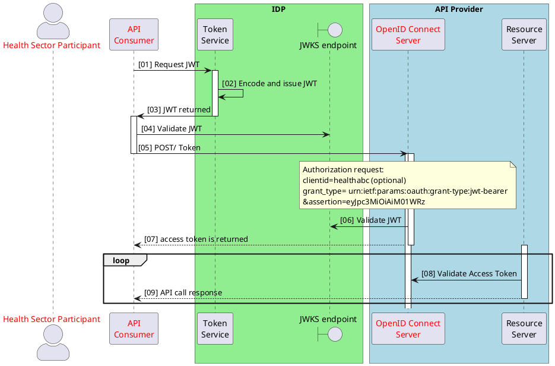
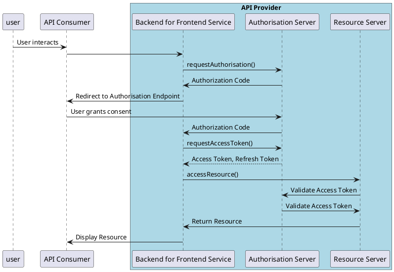

## Assertion Grant Flows

The OAuth 2.0 framework has been extended to define an additional method of securing a call to an API exposed by an API Provider by using an assertion. An assertion is a signed package that contains identity and security information that can be used across security domains to:

- Authentication the API Consumer to the API Provider's token endpoint
- Obtain an Access Token

There are two addition assertion grant flows that have been defined under the OAuth 2.0 standard.

- OAuth 2.0 JWT Bearer Assertion Grant Flow
- OAuth 2.0 SAML Bearer Assertion Grant Flow

### JWT Assertion Grant Flow

The JWT Assertion Grant flow relies on Trust relationship between the API Provider and the creator of the JWT assertion.

How the JWT is created is captured in the table below.

| JWT creation |Issues| Recommendation|
|----|----|----|
|API Consumer created JWT| <li>Compromise of the private key</li><li> Management of tokens and key rotation</li>| <ApiStandard id="HNZAS_MAY_USE_CONSUMER_CREATED_JWT" type="MAY" toolTip="API Consumer created JWT MAY be used for Server to Server flow or UNCLASSIFIED APIs.">**MAY** be used for:<li>Server to Server flow</li><li>**UNCLASSIFIED** APIs</li></ApiStandard> |
|IDP created JWT| A Trust relationship is required to be setup| <ApiStandard id="HNZAS_MAY_USE_IDP_CREATED_JWT" type="MAY" toolTip="IDP created JWT MAY be used for UNCLASSIFIED APIs or when consent is not required.">**MAY** be used for:<li>**UNCLASSIFIED** APIs</li><li>Consent is not required</li></ApiStandard> |

The Sequence flow below details the steps for the JWT Assertion Profile Flow.

<!-- cspell:disable -->


<DetailedDescription text="The diagram describes a secure communication process involving a health sector participant, an API consumer, an identity provider (IDP), and an API provider. The API consumer first requests a JSON Web Token (JWT) from the IDP's token service. The token service encodes and issues the JWT, which the API consumer then validates using the IDP's JWKS endpoint. Next, the API consumer sends a POST request to the API provider's OpenID Connect server, including the JWT as an assertion, to obtain an access token. The server validates the JWT with the JWKS endpoint and returns the access token. For subsequent API calls, the API consumer presents the access token to the API provider's resource server, which validates it with the OpenID Connect server before returning the requested API call response." />

<!-- cspell:enable -->

Note: <ApiStandard id="HNZAS_MAY_USE_JWT_BEARER_WITH_AUTH_CODE" type="MAY" toolTip="The jwt-bearer flow MAY be used with authorisation code flows." wrapper='span'>the jwt-bearer flow **MAY** be used with authorisation code flows.</ApiStandard> In this case the JWT is only used to validate the client with the API Provider.

<!-- cspell:disable -->

```json
POST /token HTTP/1.1
grant_type=authorization_code
&code=n0esc3NRze7LTCu7iYzS6a5acc3f0ogp4
&client_assertion_type=urn%3Aietf%3Aparams%3Aoauth%3Aclient-assertion-type%3Ajwt-bearer
&client_assertion=eyJhbGciOiJSUzI1NiIsImtpZCI6IjIyIn0.
```

<!-- cspell:enable -->

### SAML Assertion Grant Flow

The SAML Assertion flow is very similar to the JWT flow the only difference being that a SAML assertion is used rather than a JWT assertion.

<!-- cspell:disable -->

```json
POST /Token
grant_type=urn%3Aietf%3Aparams%3Aoauth%3Agrant-type%3Asaml2-bearer
&assertion=PD94bWwgdmVyc2lvbj0iMS4wIiBlbmNvZGluZz0iVVRGLTgiPz4....
```
<!-- cspell:enable -->

For the SAML Assertion Grant Flow, Health NZ:

<ul>
<ApiStandard id="HNZAS_SHOULD_NOT_USE_SAML_FOR_SERVER_TO_SERVER" type="SHOULD_NOT" toolTip="SAML Assertion Grant Flow SHOULD NOT be used for Server to Server flows." wrapper="li"> **SHOULD NOT** be used for Server to Server flows.</ApiStandard>

<ApiStandard id="HNZAS_SHOULD_NOT_USE_CLIENT_CREATED_ASSERTION" type="SHOULD_NOT" toolTip="SAML Assertion Grant Flow SHOULD NOT use a client created assertion model." wrapper="li">**SHOULD NOT** use a client created assertion model.</ApiStandard>

<ApiStandard id="HNZAS_MAY_USE_SAML_FOR_UNCLASSIFIED" type="MAY" toolTip="SAML Assertion Grant Flow MAY be used for UNCLASSIFIED APIs." wrapper="li">**MAY** be used for **UNCLASSIFIED** APIs.</ApiStandard>

<ApiStandard id="HNZAS_MAY_USE_SAML_WITH_AUTH_CODE_FOR_MEDICAL" type="MAY" toolTip="SAML Assertion Grant Flow MAY be used with Authorisation Code flows for MEDICAL IN-CONFIDENCE APIs when a SAML token endpoint authorisation model is required." wrapper="li">**MAY** be used with Authorisation Code flows for **MEDICAL IN-CONFIDENCE** APIs when a SAML token endpoint authorisation model is required. (See code below)</ApiStandard>
</ul>

<!-- cspell:disable -->

```json
POST /token HTTP/1.1
Content-Type: application/x-www-form-urlencoded
grant_type=authorization_code
&code=n0esc3NRze7LTCu7iYzS6a5acc3f0ogp4
&client_assertion_type=urn%3Aietf%3Aparams%3Aoauth%3Aclient-assertion-type%3Asal2-bearer
&client_assertion=PHNhbW...[
```

<!-- cspell:enable -->

## Web Application (Browser Based) Patterns

There is a draft document that defines the models for OAuth 2.0 for Browser Based applications that has a focus on Single Page Applications (SPAs). It covers the concept of running a JavaScript application in a web or mobile device that uses a backend OAuth 2.0 component to manage / proxy all OAuth 2.0 calls and resource calls. It covers the following three models:

- Backend For Frontend (Calls to API Provider token end point and Resource Server go through a Proxy backend service)

- Token-mediation Backend (Only OAuth 2.0 calls go through the proxy)

- Browser based OAuth 2.0 client (Provides advise on a frontend only model e.g. not using Implicit but using PKCE with authorisation code flow)

This section only covers the Backend for Frontend concepts.

## Backend for Frontend (BFF)

As the document defining the BFF is still in draft, Health NZ **MAY** use this for SPAs where there is a requirement to support **MEDICAL IN-CONFIDENCE** APIs.

The sequence diagram indicates where the Backend for Frontend Service resides.

<!-- cspell:disable -->



<DetailedDescription text="The diagram outlines a flow where a user interacts with an API consumer application, which then communicates with a backend for frontend service within an API provider system. The backend for frontend service requests authorization from an authorization server, which involves redirecting the user to grant consent. Upon receiving an authorization code, the backend for frontend service exchanges it for access and refresh tokens. It then uses the access token to access a resource from a resource server, which validates the token with the authorization server before returning the resource. The backend for frontend service ultimately displays the resource to the user via the API consumer application." />

<!-- cspell:enable -->
