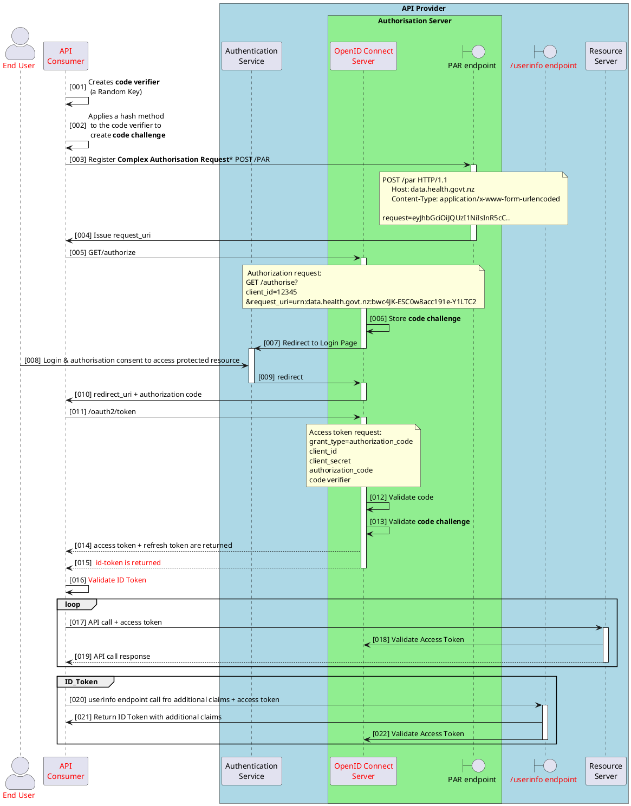

:::warning[Status]
Content is draft and in review – this content may change until review is complete and formally published.
:::

## Pushed Authorised Request (PAR)

The initial authorisation request from the client sends all parameters in the URL query string. There are security, privacy and limitations with this format:

- The increased complexity of the information in the authorise request can a surpass the URL length limitations
- Parameters are exposed in browser history and logs which could have privacy issues for the end user
- Tampering attacks on the content can occur and rely on validation of the content by the API Provider and API Consumer

PAR was introduced to address these concerns and basically introduces a new PAR endpoint for the API Provider to expose which is a secured back-channel against which the API Consumer can send the authorisation request.

PAR **MAY** be applied for MEDICAL IN-CONFIDENCE APIs or solutions that require complex authorisation requests.

### The PAR Sequence Flow

The API Consumer pushes the authorise request (as a JWT) the the API Providers dedicated PAR endpoint. A request_uri is provides back to the API Consumer. This is then used in the authorise request to the API Provider.

The sequence diagram below includes the PAR flow with Authorisation Code Grant flow with PKCE.



<DetailedDescription text="The diagram depicts an authorization flow initiated by an API consumer involving an end user, an authentication service, an authorization server with a PAR endpoint and a userinfo endpoint, and a resource server. The API consumer generates a code verifier and challenge, registers a complex authorization request with the PAR endpoint, and redirects to the authorization server for user login and consent. Upon approval, the authorization server redirects back with an authorization code, which the API consumer exchanges for access and refresh tokens, as well as an ID token. The API consumer validates the ID token and uses the access token for subsequent API calls to the resource server, which validates it with the authorization server. The API consumer can optionally call the userinfo endpoint with the access token to retrieve additional claims from the ID token." />

POST to API Provider's PAR endpoint:

```json
POST /par HTTP/1.1
Host: data.health.govt.nz
Content-Type: application/x-www-form-urlencoded

request=eyJhbGciOiJQUzI1NiIsInR5cCI6IkpXVCIsImtpZCI6IjEyMyJ9.ey.
```

GET Request to API Provider's authorise endpoint with the request_uri:

<!-- cspell:disable -->
```json
GET /authorize?client_id=12345&
  scope=openid&
  request_uri=urn%3Aietf%3Aparams%3Aoauth%3Arequest_uri%3A6esc_11ACC5bwc014ltc14eY22c  
```
<!-- cspell:enable -->

## JWT Secured Authorisation Response Mode (JARM)

PAR addresses the authorise request, JARM is aimed at addressing security concerns the authorise response. This allows the API Consumer to define how the authorise response is returned using a response_mode parameter.

This standard has been driven by the banking industry and is part of FAPI (Financial-Grave API) and allows the response to be in a signed (and if required, encrypted) JWT.

The following is the call to the authorise endpoint (using code and PKCE) and defined a response_type of jwt.

<!-- cspell:disable -->
```json
GET /oauth/v2/oauth-authorize? HTTP/1.1
Host: login.example.com
Content-Type: application/x-www-form-urlencoded

client_id=web-client&
response_type=code&
redirect_uri=https://data.health.govt.nz/callback/code&
state=1599045135410-jFe&
scope=read&
code_challenge=rerbvXfTDYNECzwayM8-SLCWU1FDzBnqMCv1RB5AudU&
code_challenge_method=S256&
response_mode=jwt
```

The following is the authorise response in a JWT format:

```json
HTTP/2 302 Found
Location: https://data.health.govt.nz/callback/code?response=
eyJraWQiOiI4ODEyMDM5NTUiLCJ4NXQiOiJWNE14UU5ZX0o1Tjl5e
XdHOEkyajJhQ2JnaFEiLCJhbGciOiJIUzI1NiJ9.
eyJleHAiOjE2NTcxOTAzNzIsImlzcyI6Imh0dHBzLy9kYXRhLmhl
YWx0aC5nb3Z0Lm56L29hdXRoL3YyL29hdXRoLWFub255bW91cyIs
ImF1ZCI6IndlYi1jbGllbnQiLCJpYXQiOjE2NTcxOTAzNTIsInB1
cnBvc2UiOiJhdXRoel9yZXNwb25zZSIsImNvZGUiOiJNNUpmWGZE
WjBVWEhMRWRUeEVwTjdFZFBCTHpDanlWOSIsInN0YXRlIjoiMTU5
OTA0NTEzNTQxMC1qRmUifQ.
X4mYFDsj9SWooC6DQ3SG7PxOP1FeNwbcl_HCbAZl-E
```

The decoded content of the JWT contains the code token:

```json
{
  "exp": 1657190372,
  "iss": "https//data.health.govt.nz/oauth/v2/oauth-anonymous",
  "aud": "web-client",
  "iat": 1657190352,
  "purpose": "authz_response",
  "code": "M5JfXfDZ0UXHLEdTxEpN7EdPBLzCjyV9",
  "state": "1599045135410-jFe"
}
```

<!-- cspell:enable -->
JARM **MAY** be used for MEDICAL IN-CONFIDENCE APIs

## Session Management

Te Whatu Ora **SHOULD** implement Session Management as defined in the OpenID Connect standards defined below.

There are four OpenID Connect Standards that try to address session management, these are:

- [OpenID Connect Session Management 1.0](https://openid.net/specs/openid-connect-session-1_0.html)
  - session state
- [OpenID Connect Front-Channel Logout 1.0](https://openid.net/specs/openid-connect-frontchannel-1_0.html)
  - Session
  - Session ID
- [OpenID Connect Back-Channel Logout 1.0 incorporating errata set 1](https://openid.net/specs/openid-connect-backchannel-1_0.html)

  - Logout token

- [OpenID Connect RP-Initiated Logout 1.0](https://openid.net/specs/openid-connect-rpinitiated-1_0.html)

  - Logout endpoint (OpenID Provider).
