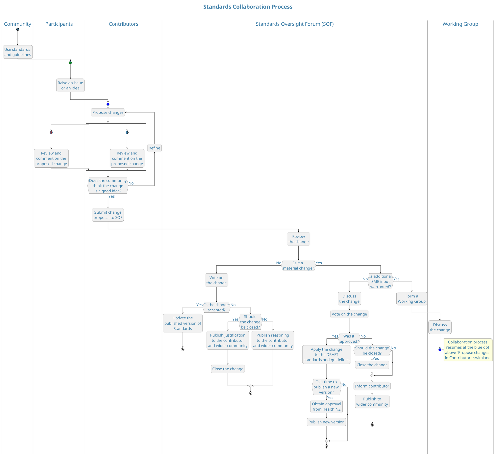

# Collaboration process

The following diagram shows how the community can collaborate together to improve the Standards. This is not a traditional process flow with an absolute start and end, but rather the process operates continually and has many points of entry (as shown by the coloured dots near the top of the diagram).

Community members are always welcome to reference the Standards to guide them in their own work.

Participants may raise questions about the Standards or suggest improvements, as well as, engage in discussions with the community about topics of interest. Some people will want to contribute specific and detailed proposals for changes, and they can do so at any time.

Anyone in the community can comment and collaborate on any open issue, discussion topic or proposed change. Moderators will monitor these conversations to ensure they remain within the [Community Guidelines](../02-guidelines/index.md). Moderators may also encourage subject matter experts (SMEs) within the community to get involved in specific issues or discussions to ensure wide community involvement.

When the community reaches general agreement about a proposed change, the Standards Oversight Forum (SOF) will consider the change and, if they also agree, will apply the change to the Standards.

The SOF assesses proposed changes for materiality, technical accuracy, alignment with wider plans for the Standards, etc. Refer to the [SOF charter](../02-guidelines/02.3-sof-charter.md) for more information.

For minor changes, the SOF can directly update the published version of the Standards. Correcting errors, adding clarifications and writing improvements are good examples of minor changes.

For material changes, the SOF will ensure the proposal has been widely discussed and well considered by the community. To this end, they may choose to form a working group to focus on a particular change or issue. The SOF will likely encourage certain community SMEs to join in, but working groups are open to anyone in the community with an interest in the topic.

Any alterations or improvements suggested by the working group are treated the same as any other proposed change, ensuring the wider community has the opportunity to collaborate and contribute to the final proposal.

When the SOF accepts material changes to the Standards, they will be published as DRAFT, which gives an early signal of upcoming changes to the community. The community is not obligated to comply with DRAFT Standards.

When a DRAFT version of the Standards is eventually published, it may impose new obligations on the community. As such, the SOF must obtain approval from the owner of the Standards (i.e. Health NZ) before publishing a new version. Health NZ may choose to consult the Health Information Standards Organisation (HISO) about the new version, as well as other NZ Health Sector organisations, depending on the level of community activity.

This Standards collaboration process continues ad-infinitum, with any proposals and opinions available for consideration and discussion by the wider community until resolved, either by an update to the Standards or by a well justified closure by the moderators or the SOF.

<DetailedDescription text="The diagram illustrates the standards collaboration process within a community. The process begins with the community using standards and guidelines, raising an issue or idea, and then proposing changes. The Contributors review and comment on the proposed change until the community agrees on the change. The Contributors then submit the change proposal to the Standards Oversight Forum (SOF). The SOF reviews the change and votes on it. If the change is accepted, it is updated to the published version of the Standards. If the change is not accepted, the SOF publishes justification or reasoning to the contributor and wider community. If the change is material, the SOF discusses the change and votes on it again. If approved, the change is applied to the DRAFT standards and guidelines, and if it is time to publish a new version, approval is obtained from Health NZ and the new version is published. If the change is not approved, the contributor is informed and the wider community is notified. If additional SME input is warranted, a Working Group is formed to discuss the change. The collaboration process resumes at the blue dot above Propose changes in the Contributors swimlane." />
