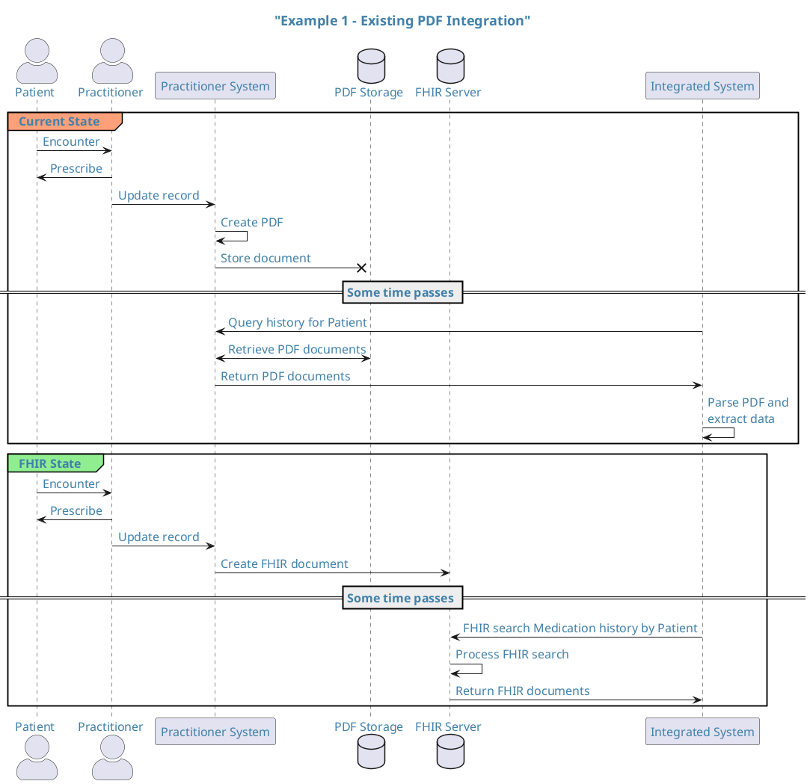
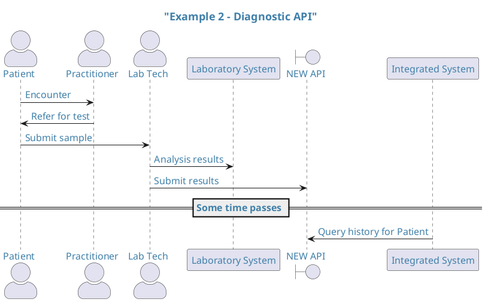
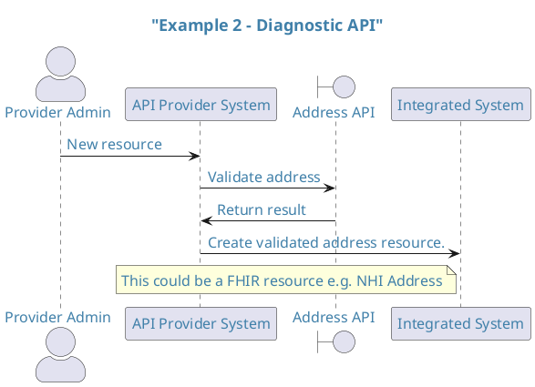

## Introduction

A number of API providers have raised the question `"When should we use FHIR and why?"`

For this reason we have developed some guidance that should help API providers make this decision and be able to accurately articulate the reasoning.

## Audience

This section is aimed at anyone who is considering creating a new API or updating / modifying an existing API and is participating in the Aotearoa New Zealand Healthcare domain.

## Where to get help

Whilst FHIR is a robust and globally recognised standard it is not without its challenges and, whilst it is improving, the level of understanding and capability in the Aotearoa health sector is relatively low. Fortunately Health NZ provide a capability to support the sector ... TODO - add details here

## Example Use Cases

## Considerations / Dimensions

**Should be appropriately weighted**

- Strategic alignment.
- Cost (capex/opex)
- Capability (human and api consumer)
- Is there a natural fit in the FHIR standard?
- Is there an agreed approach to co-existence?
- Is there any specific terminology required? FHIR can help with terminology requirements.
- Is there any technology available e.g. FHIR Server?
- Is there a non-FHIR standard in use (e.g ICHE2B, Peppol)? Expansion of "is it a natural fit"
- How do API providers determine "fit"?
- Note to self - domain naming - find some examples...(EpisodeOfCare (enrolments) and Coverage)

### Example 1: Existing PDF Integration

I am a HealthCare technology provider who provides software to HealthCare providers. The currently exchanges information with Health NZ in the form of PDF files. These PDF files contain information about medication prescribed to patients in order to be able to collate a view of the patients current and historical medication history. We are intending to modernise this integration and want to understand if this is suitable as a FHIR interface.

### Example 2: New Diagnostics API

I am a HealthCare technology provider who provides software engineering services to Health NZ. We have been asked to develop a solution that provides an API to enable the distribution of diagnostic information (test results) to consumer and practitioner channels.

## Example 3 - Address API

I am an API provider (ESAM) who provides residential and commercial address information to API consumers or providers. Health NZ consume my API in order to search or validate address information.

### Example 4 - Bulk Data APIs

e.g. Bulk data upload (batch)

e.g. Bulk data read (analytics)

e.g. Logging / Auditing

### Example 5 - HL7 v2.*

### Example 6 - Non-clinical resources

e.g. Claims, Invoices and Payments (wefare, devices?)

e.g. Directories (HealthPoint - currently FHIR)

### Example 7 - SaaS product

e.g. Twillio

## Key Contacts

Initial focus internal.
Need something that can be applied to an internal governance process

- Architecture (Enterprise)
- Strategy and Delivery
- Integration
- Regional architecture - interoperability leads
- Programmes - Hira initially
- Business representatives - who can provide details?? NPHS + HSS
- Provider community - those who provide capability to TWO?? Whanau Tahi
- HL7 - John Carter??
- Governance (TDC or it's successor)
- Hiso - Alastair K [SF]
- Panel partners

