This section looks at API design and offers the standards required to support [health sector organisations](../api-concepts/ComponentDefinitions#health-sector-organisations) in designing, developing and governing APIs. The intended audience for this section of the document is **_technical_** for example [API developers](../api-concepts/ComponentDefinitions#api-developers), or [API designers](../api-concepts/ComponentDefinitions#api-designers).

When reading this section consider the implications for your organisation. Fundamentally, APIs should make interoperability with your
organisation simple, but more importantly consistent.

Application developers will invest heavily in using your API. They will
invest in learning the design and behaviour of your API, in developing
and testing around your API and may even invest in developing an entire
business model on your API.

Good API designs will attract more developers. Conversely, bad API
designs will drive away developers and drive up costs – support costs,
maintenance costs and operating costs.

## When is an API appropriate?

In the past, the default reaction to a requirement for capability has
been to develop a web application. This is now gravitating towards APIs
as the default. So, when is it better to build an API than a web
application? Below are some situations where an API may be more
appropriate:

- When applications are screen scraping data from your website

- When your organisation holds a single authoritative source of the truth

- Where there is a need for real or near real time information exchange with a partner

- When parts of a business process are (or may be) outsourced

- When your organisation data or service can be included as part of a larger business process

- When there is a requirement for internal systems to interact with cloud-based COTS solutions (SaaS)

- Where businesses require easy access to (public) information

- Where commercial organisations want to build capability into their own applications that will benefit the public (mobile/web apps)

- If you expect other parties to act as agents or intermediaries for services provided by your organisation

- When multiple service delivery channels are in use.

Developing traditional applications for each of these situations would be expensive
and time consuming.  Developing APIs allows you to focus on the access to your data, the
quality, integrity
and security considerations to protect the value of the data while other organisations
develop applications or uses for the data specific to them. This is a change in thinking
from functionality and applications to make data available to others for them to use.

## Types of API

There are several different types of API and the type you choose may depend on the technical use cases that you apply to both consumption and provision of your API.

| API Type              | Description                                                                                                                                                                                                                                                                                                                                                                                                                                                         | Usage                                                                                                                                                                                                                                                                                                                                                                                                                                                                                                                                                                                      |               Status                |
| :-------------------- | :------------------------------------------------------------------------------------------------------------------------------------------------------------------------------------------------------------------------------------------------------------------------------------------------------------------------------------------------------------------------------------------------------------------------------------------------------------------ | :----------------------------------------------------------------------------------------------------------------------------------------------------------------------------------------------------------------------------------------------------------------------------------------------------------------------------------------------------------------------------------------------------------------------------------------------------------------------------------------------------------------------------------------------------------------------------------------- | :---------------------------------: |
| **REST**              | Representational State Transfer (REST) is the most common and well understood API type. REST should be considered an architectural style for developing distributed hypermedia systems. There is a wealth of information and tooling to support the definition and creation of REST APIs. Typically, a REST API will have a well-defined and strongly typed schema definition (OpenAPI) where strict compliance can be achieved.                                    | Creating distributed systems where a set of API resources are well defined. If medium latency resource creation or modification (POST, PUT, DELETE) is required then typically a REST API is a better fit. Typically used for synchronous interactions.                                                                                                                                                                                                                                                                                                                                     |    Supported :white_check_mark:     |
|                       |                                                                                                                                                                                                                                                                                                                                                                                                                                                                     |                                                                                                                                                                                                                                                                                                                                                                                                                                                                                                                                                                                            |                                     |
| **GraphQL**           | GraphQL is an open source query and manipulation language developed by Facebook primarily designed to empower API consumers to consume only the data that they require. A common criticism of REST is that only the entire resource is available for consumption, sometimes referred to as “over fetching”, however with GraphQL the client decides the data that it requires. GraphQL also has a strongly typed schema (GraphQL Schema Definition Language – SDL). | An API that has a widely distributed client set with a variety of data requirements. Particularly well suited to high read (GET) clients                                                                                                                                                                                                                                                                                                                                                                                                                                                   |    Supported :white_check_mark:     |
|                       |                                                                                                                                                                                                                                                                                                                                                                                                                                                                     |                                                                                                                                                                                                                                                                                                                                                                                                                                                                                                                                                                                            |                                     |
| **Asynchronous APIs** | AsyncAPI is an open source initiative to create an event-driven and asynchronous API standardisation and development tooling. The AsyncAPI specification, inspired by the OpenAPI specification, describes and documents event-driven APIs in a machine-readable format.                                                                                                                                                                                            | Creating distributed systems where a set of API resources are well defined. Typically used for asynchronous interactions and event driven architectures. Also, useful when developing APIs that front workflows or long running orchestrations.                                                                                                                                                                                                                                                                                                                                            |    Supported :white_check_mark:     |
|                       |                                                                                                                                                                                                                                                                                                                                                                                                                                                                     |                                                                                                                                                                                                                                                                                                                                                                                                                                                                                                                                                                                            |                                     |
| **gRPC**              | gRPC is a modern open source high performance Remote Procedure Call (RPC) framework that can run in any environment.                                                                                                                                                                                                                                                                                                                                                | Creating distributed systems that require highly performant and scalable API's. gRPC makes use of binary data rather than just text which makes the communication more compact and more efficient. In gRPC, a client application can directly call a method on a server application on a different machine as if it were a local object, making it easier for you to create distributed applications and services. This is enabled by a formal Interface Definition Language (IDL). gRPC utilises Protocol Buffers by default, you can make it work with other data formats, such as JSON. |          Not Supported :x:          |
|                       |                                                                                                                                                                                                                                                                                                                                                                                                                                                                     |                                                                                                                                                                                                                                                                                                                                                                                                                                                                                                                                                                                            |                                     |
| **SOAP**              | SOAP APIs are formatted as XML files and they are extremely common web communication protocols. The acronym stands for Simple Object Access Protocol, and it was developed in the late 1990s. Despite its age, SOAP still remains one of the more popular API types used by developers.                                                                                                                                                                             | Stateful operations; if the application needs contextual information and conversational state management then SOAP 1.2 has the additional specification in the WS\* structure to support those things (Security, Transactions, Coordination, etc). Comparatively, the REST approach would make the developers build this custom plumbing.                                                                                                                                                                                                                                                  | Deprecated :warning: |

Example Technical Use Case Synchronous/Asynchronous API

The illustrative example below demonstrates a combination of a
synchronous API and an asynchronous API.

```plantuml alt="PlantUML diagram describing Example Use Case - Synchronous/Asynchronous Claims API"
@startuml

title "Example Use Case - Synchronous/Asynchronous Claims API"

skinparam {
    defaultFontColor #4080a9
    defaultBackgroundColor #d7f8ff
    defaultComponentColour #61d9de
    defaultActorColour #61d9de
    defaultFontSize 16
    defaultArrowThickness 6
    actorStyle awesome
    linetype polyline
}

actor "Health Sector\nParticipant" as C
actor "Health Sector\nOrganisation" as P
entity "API Consumer" as SPS
entity "Notification Endpoint" as NE
control "API Provider" as CA
entity "API Provider\nCore System" as ACS
!pragma teoz true
==Register==
SPS -[#Pink]> CA : POST /register
note right of SPS
    This call is to enable the API Consumer
    to register their notification endpoint. Note
    that this is illustrative only. In reality most API
    consumers will register with Health NZ using a
    developer portal or equivalent and create client
    application credentials with registered notification
    endpoint(s).
end note

CA -[#Pink]> SPS : Return registration details
==Create Claim==
{start} C -[#Blue]> P : Access funded product\nor service
P -[#Blue]> SPS : Create claim details
SPS -[#Green]> CA : Register claim
CA -[#Pink]> ACS : Create claim
ACS -[#Pink]> ACS : Create claim and\nassign to workflow
ACS -[#Pink]> CA : Return claim identifier and status
CA -[#Green]> SPS : Return claim id and status
SPS -[#Blue]> P
{end} P -[#Blue]> C
{start} <-> {end} : Synchronous
==Subscribe to events==
SPS -[#Green]> CA : SUB claims/{claimId}
==Receive Updates==
{asstart} C -[hidden]-> P
ACS -[#Pink]> ACS : Workflow update
ACS -[#Green]x CA : PUB claims/{claimId}
CA -[#Green]> SPS : Receive subscription message
alt Web Hook
    CA -[#Green]> NE : Send hook notification
    NE -[#Pink]> SPS : Forward notification
end
SPS -[#Pink]> P : Notify
{asend} P -[#Blue]> C : Notify
{asstart} <-> {asend} : Asynchronous

legend
    |= Color |= Type |= Description |
    | <size:11><back:#Green>           </back></size>|    <&arrow-right> | API Interaction |
    | <size:11><back:#Blue>           </back></size>|    <&arrow-right> | Human Interaction |
    | <size:11><back:#Pink>           </back></size>|    <&arrow-right> | System Interaction |
endlegend

@enduml
```

<DetailedDescription text="The diagram illustrates the use case of the Synchronous/Asynchronous Claims API for funded products and services. It depicts the interactions between various entities involved in the API, including API Consumer registration, claim creation, event subscription, and real-time notification updates. The API Consumer initiates the registration process by sending a POST request to the API Provider's /register endpoint. The Health Sector Participant accesses a funded product or service, prompting the Health Sector Organisation to generate claim details and send them to the API Consumer. The API Consumer forwards the claim details to the API Provider, who registers the claim in the API Provider Core System and relays a claim identifier and status back to the API Consumer. The API Consumer subscribes to claim events for a specific claim identifier by sending a SUB request to the API Provider's /claims/{claimId} endpoint. Upon claim status updates, the API Provider Core System generates a notification and transmits it to the API Provider. The API Provider publishes the notification to the API Consumer's registered notification endpoint, who relays it to the Health Sector Participant. The Health Sector Participant then informs the Health Sector Participant of the status update."/>

The example above has two associated API specifications. The first is an
OpenAPI specification that describes the "Create Claim” and "Get Claim”
RESTful interactions and the second is an AsyncAPI specification that
describes the "Receive Updates” interaction. These example
specifications are available for reference [here](../api-specifications/example-agency-specification)

## API Design Principles

### Future-Focused Design

APIs should avoid exposing obsolete or legacy structures or functions.

Good API design seeks to avoid future breakage in dependent consumer applications by minimising functions, data structures and behaviour exposed, while planning for (at least signalling) foreseeable future change.  

Like any interface that has to be maintained, **less is definitely more** when it comes to functions, structures and behaviour exposed.

### Layering

When designing and developing an API it is important to consider that an
API is made up of distinct functional layers:

- Security

- Caching

- Representation

#### Security

Every API will have a security component. It is important to recognise
that this is not only authentication and authorisation for access to an
API, it also includes threat protection (DDoS, SQL Injection, Cross site
scripting etc.) as well as availability and quality of service (QoS).
When designing and developing APIs it is often cost effective to create
a common framework that handles security for all APIs. See the
associated document, [Part B: API Security](../api-security), for more details.

#### Caching

Caching can dramatically improve the performance of an API. When
designing APIs consider what, when and where to cache. Understanding how
data is changed and how often it is changed is an important
consideration, as well as which layer it is most appropriate to cache
at. A common caching strategy should be developed for APIs that would
benefit from it. See [Caching](./Caching) for more details.

```plantuml alt="PlantUML diagram of API layering"

@startuml

scale max 400 width
'left to right direction

skinparam {
    arrowThickness 2
    arrowColor #Green
    defaultFontColor #4080a9
    defaultBackgroundColor #d7f8ff
    defaultComponentColour #GhostWhite
    defaultActorColour #61d9de
    defaultFontSize 12
    actorStyle awesome
    linetype ortho
    minRectangleWidth 100
}
actor "Health\nSector\nParticipant" as Consumer
component "API Consumer" as APIC
component "Security" as S
component "Caching" as C
component "**API**" as API #LightSalmon

Consumer -r-> APIC
APIC -r-> S
S -r-> C
C -r-> API

API -[#blue,dotted]l-> C
C -[#blue,dotted]l-> S
S -[#blue,dotted]l-> APIC
APIC -[#blue,dotted]l-> Consumer

@enduml

```



<DetailedDescription text="The diagram illustrates the interactions between a health sector participant, an API consumer, security, caching and API components. The health sector participant initiates the process by performing some action within the API consumer. The API consumer makes a request and calls the security component for authentication and authorisation. The security component communicates with the cache which fulfils or passes through the data request as needed. Behind the cache is the API component itself which implements the API's operations and defines the representation of data served. A response flow returns data to the API consumer in the opposite direction." />

### Standards-Based

Web standards have rapidly become powerful agreements, which span not
just local regions but are internationally accepted and enable
commonality and consistency. Using standard HTTP and URLs, the core
technologies of the web, along with standards such as JSON and OAuth 2.0
ensures that organisations are not creating bespoke or proprietary
technologies.

Hence the principle is to build to the latest versions of existing open
and accepted standards e.g.

- HTTP
- OpenAPI
- AsyncAPI
- REST
- JSON
- OAuth 2.0
- OIDC

Refer to the [API Development Industry Standards](/api-development/DevelopmentIndustryStandards) for detailed
information about relevant standards.

## Designing an API

When designing an API, it is important to perform business process
analysis to ensure that API development is business-driven rather than
technology-driven. Technology driven projects rarely meet customers’
needs in the long run, so it is important to gain background in who could
be using the API and for what. As mentioned previously, co-design is
fundamental to driving the right API development. To help identify
potential partners to involve in the co-design, consider:

- processes that currently depend on information the API could expose

- processes that require a capability an API could expose

Some actors in the design process will be human such as [application developers](../api-concepts/ComponentDefinitions#application-developers) or [health sector participants](../api-concepts/ComponentDefinitions#health-sector-participants) whilst some
actors will be [systems or organisations](../api-concepts/ComponentDefinitions#health-sector-organisations) that will interact with, or depend on, the
API.

When representatives for the potential actors are identified, start
co-designing with these representatives. First and foremost, consider
the requirements for the API. Application developers often couch their
requirements in terms of how the API should work, rather than what the
API needs to do. Don’t get bogged down in the variety of proposed
solutions from each developer: focus on extracting their true
requirements by performing functional analysis (e.g. use cases) and data
flow analysis. Then identify resources and work out the granularity
needed (see [Granularity](#granularity)).

It is especially important that security and information privacy impacts
are identified up front and addressed early on in the design process.
Assess the information being passed and the types of access different
customers and/or consuming applications should have to the API. This
will help drive development of security policies alongside the design of
the API.

One common pitfall in API design is to map all existing data tables onto
resources and develop the associated CRUD capabilities into an API.
Usually this results in a poor API design and tightly couples the API
design to the underlying data structure. Another common pitfall is to
design APIs as an extension to, or way into, monolithic legacy systems.
This should be avoided as it tightly couples the API to the legacy
system. Both of these pitfalls will create issues for both API providers and
API consumers in the long term.

At this point in the design process, agility is probably more important
than completeness. Share early design thoughts and interface
specifications with the developer community and quickly make changes in
response to their feedback. Work through some sequence diagrams with
them to help pin down API interactions and inform API design thinking.

The correct API design will likely not please every developer, so don’t
try to be all things to all developers. A rule of thumb is that you are
probably on the right track if most developers are a _little_ unhappy,
but all are able to achieve their aims with the proposed design.

It is important not to try to bypass evolution steps and try to build
for all potential use cases right from the offset. For a more measured
progression towards API delivery, start simple and focus on a single
channel or interaction initially. By building onto these simple building
blocks, API evolution over time naturally progress towards omnichannel
applications.

## Design Considerations

The following considerations emerge when looking to develop APIs in the
health sector:

- Understand your data, understand your API consumers. Before starting
  work on APIs, gain a good understanding of what data you hold, the
  complexity of that data, its relationships to other data, the
  downstream dependents on that data and potential API consumers of the
  data. It is also a good idea to understand your API consumers' drivers
  and downstream usage or customers.

- Design for REST. If the interaction appears RESTful then develop a
  REST API, e.g. one-to-many. In some cases however a GraphQL
  API may be appropriate and is supported by this document. REST APIs
  are widely understood, easier to govern and suitable for most
  interoperability use cases. It is also important to note here that
  if there is an appropriate resource in the Fast Health
  Interoperability Resource (FHIR) standard then a FHIR approach
  should be considered. See this documents [FHIR API Guidance](../fhir-api-standard)

- The information supplied via an API may still be dependent on
  overnight batch processes for update. It is worth making the
  information’s timeliness and update period clear to potential
  API consumers.

- APIs should not be used to handle large batch transfers because of
  the atomic nature of the usage i.e. if one single data write fails
  then the whole batch fails. APIs work better for multiple individual
  update transactions.

## Design Driven Development

:::tip[Guidance]
MUST
:::

When building APIs, a Design Driven Approach must be taken.

This includes:

- Interface specification first

- Implementing an Iterative Design Approach

- Performing Continuous integration/deployment/testing

### Interface Specification First

The best way to design an API is in collaboration with potential
API consumers. Creating the interface specification first makes
it easier for application developers to see what the API is going to
offer and how it could be used. Their early feedback will ensure that
the API design is heading on the right track and will be usable and
appropriate to their needs. Using a simple modelling language to define
the interface specification makes it easy to view and edit API
definitions. See [Interface Specification](#interface-specification) for
more information about defining interface specifications.

### Iterative Approach

It has been acknowledged that big bang releases rarely deliver business
or customer benefit. An iterative approach, with ongoing releases
offering gradual improvement or evolving capability, gives a finer tuned
delivery, better sense of momentum, illustrates progress and enables
third parties to coordinate efforts with API developments.

An iterative approach incorporates continuous improvement, that
recognises the need to support continuing evolvement of the API beyond
the first delivery. The API is a product whose capabilities should
undergo continuing improvements based on API consumer feedback, performance
analytics and emerging needs. This aligns to Phase 6 in the Accelerate
framework.

### Automation First

Automation provides a quick turnaround for informing API developers
about breaking changes being submitted by developers who are all working
on the same code base or product (e.g. API). The idea is that all
developers submit code changes as often as possible (e.g. into a version
control system), allowing code to go through an automated, integrated
build process which ensures that nothing has broken the build. This
build process could happen many times a day. Any errors are quickly
identified and alerted to the team who can rectify them in a timely
fashion.

Tests can be written against the interface specification early
in the development process by developing just enough API code to enable
the test to be run (stubs or mocks). The tests can then be incorporated into the
automated build process, giving early warning of regression test
failures. API code should not be able to progress through SDLC
environments until successful test execution.

## Granularity

There is a question as to how fine-grained an API resource should
be. APIs should be designed at the lowest practical level of granularity
because this makes each resource simpler and allows them to be combined
in ways that suit the application developer. The key principle is to
design APIs that can be re-used and combined in different ways, and
not tie the application developer to a specific way of working or
sequence of API consumption just because that is how it is configured or
built in the back end.

If an API offers very fine-grained resources, then consuming
applications end up having to make many more calls to the API in order
to collect all the information they need, resulting in chattier
communications. On the other hand, if the API is based on very coarse
grained resources (returning everything about the resource) the response
payloads could end up being enormous, may not support all API
application developers’ needs, and the API could become cumbersome to
use and maintain.

There may also be a need for varying granularity within one API,
depending on the purpose and use of that API. For example, if a clinical imaging
API was being created, it may make sense to offer a coarse grained
resource for posting a new image set as a bundle of content including
images, observations, keywords as well as the supporting information for the images. But when
offering the ability to comment on the images it would make
sense, for clarity and ease of use, to offer these as separate
sub-resources, for example, notes or comments.

It is important to aim for a granularity that will prevent business
logic from leaking into the API e.g. requiring API calls to be made in a
certain sequence to meet with internal business processes. With the
imaging example, consider the impact of a fine-grained API being
offered for posting an initial encounter, with separate calls for adding subsequent images or metadata. If metadata is mandatory, then the application
developer (API consumer) needs to ensure that every new post call to the API to create an image is followed by a
metadata call. This puts the onus on the application developer to get
the sequence of calls correct and could lead to inconsistent data if
they do not adhere to the rules. It also leads to close coupling between
the consuming application and the API, and if the business logic changes
in the future there is a downstream impact on all application
developers, requiring them to modify their applications.
General guidelines are:

- Don't aim for the finest granularity - an API should be built around
  each discrete and updatable resource

- There does not need to be a one-to-one mapping between a manual
  service and a corresponding API; APIs should support the process but
  not try to encapsulate the process

- A rough guide is to have one API operation for each entity lifecycle
  state transition

- Resources can be identified by reviewing a business process and
  identifying the key entities that underpin the process. Any
  entities that the organisation manages or maintains throughout its
  full lifecycle will be potential API resources. There is typically
  one API operation for each entity lifecycle state transition.

- There should be only one API operation for one business outcome (e.g. change an address)

- Consider using query parameters in URLs for different granularity of
  resources. For example, /appointments could return a list of
  appointments, whilst /appointments?$summary could return a summarised view.

## Interface Specification

An API represents a contract between the API provider and the API consumer for
access to provider resources. Because API consumption is a programmatic
exercise, it is important to have a clear definition of what the API
offers and how those API resources are to be accessed. This definition
is the interface specification.

The interface specification should be designed in advance of developing
the API, as the act of working out the specification often helps think
through all the issues that could impact the design of the underlying
resource-handling code. It also helps consuming application developers
to review the capabilities being offered to see if the capabilities meet
their needs before they start developing to the specification. When
outsourcing API development, the interface specification can be written
in abstract as a means of defining the API the vendor should build. The
specification can be handled as a separate entity, is version
controllable, and it should be possible to use it as the main API
documentation or reference.

There are several API modelling languages available for defining the
interface specification. Some are proprietary (e.g. RAML, API Blueprint)
whilst others are machine-readable but not human readable (e.g. WADL).
The most commonly used API modelling language today is an open standard
known as the OpenAPI Specification (formerly Swagger) maintained by the
Open API Initiative. This initiative is supported by many of the main
commercial entities in IT (Google, IBM, Microsoft, Atlassian, Paypal
etc.). It offers a standard, programming language-agnostic (JSON/YAML)
interface to REST APIs which allows both humans and computers to
discover and understand the capabilities of the service. For an example
of a Swagger interface specification see [Example Interface
Specification](/api-specifications/example-agency-specification).

It is important to use a modelling language to define the API interface
specification as essentially it is text or code and can be maintained
using source code management systems.

Use [OpenAPI/Swagger](https://openapis.org/) as the interface
specification language for all APIs being developed.

## Orchestration

As a general rule using APIs as an orchestration tool is not
recommended. This is due to the complexity that this can introduce to an
API architecture. That said, however, simple orchestration may in some
cases be appropriate. An example of this may be a mashup API that
creates a new logical API resource by combining related data held in two
or more back end systems.

A mashup is not appropriate when you create an API that merges two
distinct API products together. If an API consumer requires this
functionality the mashup should be performed by the consuming
application.

Other examples of simple orchestration could include mediation such as
message transformation (JSON to XML or canonical message model
transformation).

## Software Development Kits (SDK)

It is recommended that API Providers offer an SDK to developers of
consuming applications.

An SDK can be considered the implementation toolset for use of an
organisation's APIs. By providing developers with an SDK they can build
applications faster without having to understand all of the API’s
complexities. An SDK should provide sample code that explains the
functionality of your API to potential application developers.

Some examples of health sector specific SDKs include:

| SDK | Description |
|:--|:--|
| [Google Cloud Healthcare API SDK](https://cloud.google.com/healthcare-api/docs/store-healthcare-data-client-library) | The Google Cloud Healthcare API SDK is a collection of tools and libraries that help you build healthcare applications on Google Cloud Platform (GCP). The SDK includes APIs for managing patient data, scheduling appointments, and billing. |
| [Microsoft Azure Healthcare API SDK](https://learn.microsoft.com/en-us/dotnet/api/overview/azure/healthcare-apis?view=azure-dotnet) | The Microsoft Azure Healthcare API SDK is a collection of tools and libraries that help you build healthcare applications on Microsoft Azure. The SDK includes APIs for managing patient data, scheduling appointments, and billing. |
| [Amazon Web Services (AWS) Health API SDK](https://docs.aws.amazon.com/health/latest/ug/health-api.html) | The AWS Health API SDK is a collection of tools and libraries that help you build healthcare applications on Amazon Web Services (AWS). The SDK includes APIs for managing patient data, scheduling appointments, and billing. |

Once an API is in sufficient state to be offered to API consumers, the
API definition should be published to the Health NZ API Marketplace or equivalent health sector capability. The primary API
discoverer is the developer, so an external API must be well documented,
and provide accurate and up-to-date guidance via the catalogue.
