## Develop a FHIR data model to communicate the data design

Data models help people understand what information is being collected and managed and how it relates to other data in existing systems/applications.

A FHIR data model can be used to effectively illustrate how FHIR resources are used and extended to represent information in a particular solution domain, and how related data in existing systems is referenced.

FHIR API designer/developers should consider use of a FHIR data model to illustrate data features and aspects such as:

- The key FHIR resource datatypes, and whether these are standard or extended (profiled),
- The important FHIR references which need to exist between the resources,
- The boundaries of FHIR data management showing where references exist to data managed in other external systems,
- Data elements that are extensions to FHIR,
- Shared definitional resources which are expected to be configured as part of the ecosystem.

### FHIR data model

The following diagram is suggested to API designers/developers as an example of how to represent a FHIR data model.  

It is intended to be a one-page entity-relationship diagram and uses UML 2.0 class diagram notation.

Health NZ has found that these kinds of diagrams can easily be created and managed using [**plantuml**](https://plantuml.com) which is a free language for diagram creation.  This enables the plantuml diagram source code to be version-controlled and shared, and diagrams can easily be generated on-demand for [incorporation into Implementation Guides](https://build.fhir.org/ig/FHIR/ig-guidance/diagrams.html), websites or Confluence pages.

```plantuml
@startuml FHIR-datamodel-example-rheumatic-fever

top to bottom direction
scale 600 width

skinparam ActivityDiamondBackgroundColor #RoyalBlue
skinparam ArrowColor #RoyalBlue   
skinparam ArrowFontColor #RoyalBlue   
skinparam ArrowFontSize 12
skinparam ArrowMessageAlignment right
skinparam BoxPadding 10
skinparam ClassFontSize 16
skinparam ClassFontStyle bold
skinparam dpi 300
skinparam FooterFontSize 14
skinparam FooterFontStyle italic
skinparam LegendBackgroundColor #Snow
skinparam LegendFontName Helvetica
skinparam LegendFontSize 16
skinparam linetype ortho
skinparam nodesep 60
skinparam NoteBackgroundColor #LightYellow
skinparam NoteFontSize 15
skinparam NoteTextAlignment left
skinparam ranksep 60
skinparam roundcorner 5
skinparam TitleFontSize 20

caption FHIR resource data model example

!procedure $Coding($Alias,$System,$Code,$Display)
  object "<color:GhostWhite>$System" as $Alias #MediumPurple {
    <color:GhostWhite><size:11>**$Code**-$Display
  }
!endprocedure


title "Rheumatic fever FHIR resources (pilot phase)"

frame "Rheumatic fever bounded context - FHIR resource types" as HNZMain {

  class ":Appointment" as APPT <<APPOINTMENT>> #GhostWhite ##[bold] {
    Appointments in which preventative 
    (prophylactic) medication is administered.
    ----
    * text "Secondary prophylaxis appointment"
    * status: ""#booked | #arrived""
    * start: instant (UTC)
    * end: instance (UTC)
    * participant: Reference(Practitioner)
  }


  class ":RheumaticFeverCarePlan" as CP <<CAREPLAN>> #LightSalmon ##[bold] {
    Profiles FHIR CarePlan so it can act as 
    registration for rheumatic fever patients. 
    ---
    *identifier[NHI] (official): NHI
    *identifier[case] (usual): case Id (salesforce)
    ---
    * title "Rheumatic fever care plan for patient X"
    * status: ""#active"" etc.
    * period: date range
    * category: SNOMED ""#tbc"" "RF secondary prevention care plan"
    * intent: ""#Plan"" etc.
    * activity[]: 
      \tReference(MedicationRequest or Appointment) **only**
    -- extensions --
      + **onHoldReason**: string
      + **closureReason**: string
  }

  class ":RheumaticFeverPatient" as RfPatient <<NZPATIENT>> #LightSalmon ##[bold] {
    Profiles NzPatient so it can define
    whﾄ］au care team members as contacts 
    ---
    *identifier[NHI] (official): NHI
    ---
    *name: HumanName
    *birthDate: date
    *communication.language
    *gender: code
    *deceasedBoolean: boolean
    *telecom: ContactPoint[]
    *address: Address[]
    +iwi: code
    +ethnicity 0..*: code[]
    +nzCitizen: code
    .. (extensions)..
    +**patient.contact[].**
      \t **whﾄ］auMemberCareRole**: Coding
      \t **whﾄ］auMemberCareRelationship**: string
      \t **whﾄ］auMemberCarePrimary**: boolean
    +**interpreterRequired**: boolean
  }

  class ":Consent\n(data collection)" as Consent <<CONSENT>> #GhostWhite ##[bold] {
      Represents a patient's active or
      provisional consent to RF Services 
      collection and use of data.
      ----
      * status: ""#proposed | active"" 
      * scope: ""#patient-privacy""
      * dateTime: date
      * period: date range
      * policy: uri
  }


  class ":RheumaticFeverCondition" as Condition <<NZCONDITION>> #LightSalmon ##[bold] {
    Profiles NzCondition (NZ Base) for RF 'case' details.
    ---
    * identifier (usual): {{salesforce diagnosis Id}}
    ---
     * code: SNOMED diagnosis code
     * severity: ""#mild | #moderate | #severe""
     * clinicalStatus: #active etc.
     * recordedDate: date
    -- extensions --
      * **rhdSeverity**: code (dedicated ValueSet)
      * **diagnosticCertainty**: code (dedicated ValueSet)
  }

  class ":Medication" as MED <<MEDICATION>> #GhostWhite ##[bold] {
    * code: SNOMED (brand)
    * ingredient: SNOMED (type)
  }

  class ":MedicationRequest" as MEDREQ <<NZMEDICATIONREQUEST>> #GhostWhite ##[bold] {
    Medication that is planned for RF prevention
    ---
    *status: code //medicationRequestStatus//
    *intent: ""#plan""
    *authoredOn: dateTime
    *validityPeriod: dateTime
    * dosageInstruction:
      \troute: SNOMED
      \tsite: SNOMED
      \tdoseAndRate
      \tadditionalInstruction: SNOMED [frequency]
  }

  
  class ":MedicationStatement" as MEDSTMT <<NZMEDICATIONSTATEMENT>> #GhostWhite  ##[bold] {
    Detail of benzathine etc.
    actually administered
    --
    status: ""#completed""
    code: NZMT
    note: brand of benzathine used
  }

  class ":MedicationStatement" as CONTMEDSTMT <<NZMEDICATIONSTATEMENT>> #GhostWhite  ##[bold] {
    Strength of lignocaine 
    administered for pain relief
    --
    medicationCodeableConcept: NZMT
  }

  class ":Encounter\nsecondary prophylaxis " as Encounter <<ENCOUNTER>> #GhostWhite ##[bold] {
    Tracks patient's appointment visit.
    ---
    * class: ""#AMB"" "ambulatory"
    * status: ""#planned | #finished""
    * participant[]: Reference[Patient, Practitioner]
    * period: datetime range
    * location: Reference[HPI facility]
  }

}

frame "Health NZ national systems" as National {

  class "RFCCS (Salesforce)" as RFCCS <<external data>> #SkyBlue {
    Salesforce logical resource
    ---
    * logical id: CarePlanId
  }

  class "Episurv" as EPISURV <<external data>> #SkyBlue {
    Notifiable disease surveillance
    ---
    * logical id: Episurv number
  }

}

frame "Health NZ NHI/HPI" as NationalIdentifier {

  class "Patient (NHI)" as Patient <<logical resource>> #SkyBlue {
    * logical id: NHI
  }

  class "HPI" as HPI <<logical resource>> #SkyBlue {
    logical identifier formats:
    + ""NNXXXX"" - 
      \tpractitioner CPNs
    + ""GXXNNN-C""
      \tHPI Org Id - orgs
    + ""FXXNNN-C""
      \tHPI Facility Id - locs
  }

  Patient -[hidden]d- HPI

}

' ********
' * Entities outside any frame are in other bounded contexts

class "RelatedPerson" as Related <<logical resource>> #SkyBlue {
  * logical id: name
}



class "NZMT terminology" as NZMT <<logical resource>> #SkyBlue {
  * medication coding
}

' ********
' plantuml positioning

' ********
' * resource linkages

APPT "supportingInformation\n<size:18>1" -- "appointment\n<size:18>1" Encounter: <>

'Condition "1" - "1" DIAG: > "stage.\nassessment"

CP "addresses" -[#SlateGray]u-{ Condition : >
'CP "supportingInfo" }--{ "basedOn" QR: <>
CP "subject" - "1" RfPatient
CP "activity.\nreference" -[#SlateGray,thickness=4]d-{ "basedOn" MEDREQ: >
CP "<color:RoyalBlue>**Identifier[NationalSystem]**" .[#SkyBlue]u. "1" RFCCS : > "<color:RoyalBlue>Salesforce care plan Id"
' CP "careTeam" ---{ CareTeam
CP " activity.\nreference" -[#SlateGray,thickness=4]l-{ APPT: >
CP "author" }.[#SkyBlue,dashed]. HPI : > ""CarePlan.**author**"" \nidentifies Lead Provider

' CareTeam "participant.member" }.[#SkyBlue,norank].{ HPI
' CareTeam "participant.member" }.[#SkyBlue]..{ Related

Condition .[#SkyBlue]. "1" Patient : > subject
Condition "<color:RoyalBlue>**Identifier[NationalSystem]**" .[#SkyBlue]u. "1" EPISURV : > "<color:RoyalBlue>Episurv number"

Consent "patient" .[#SkyBlue]. "1" Patient : >
Consent "performer" .[#SkyBlue,norank]. "1" HPI : >

'DIAG "basedOn" }-- CP

Encounter .[#SkyBlue,norank]. "1" HPI: > "participant,\nserviceProvider" 

MEDREQ "medication[x]" }-d- "1" MED : >
MEDREQ "requester" .[#SkyBlue,norank]. "1" HPI
MEDREQ "subject" .[#SkyBlue,norank]. "1" Patient


MEDSTMT -l-* "partOf" CONTMEDSTMT: <
MEDSTMT "1" -- "1" Encounter: > context
MEDSTMT "basedOn" }- MEDREQ : >
MEDSTMT "medication\nReference" }--"1" MED: > 

MED "code\ningredient" .[#SkyBlue]d- NZMT
CONTMEDSTMT "lignocaine\nconcentration\ncoding".[#SkyBlue,norank]d- NZMT

RfPatient "Identifier[NHI]" .[#SkyBlue]r. "1" Patient

' QR "encounter" --> Encounter
' QR "<color:Red>questionnaire" }.[#Red]l.. Questionnaire: > \n\n\n\n

legend left
  **Notes**
  - Model of data types (FHIR resources) and relations (FHIR references) for national rheumatic fever FHIR data.
  - Arrows show direction of FHIR reference.
  - Solid/open dots indicate mandatory/optional data elements.

  **Key to datatype colours**
  |= colour |= stereotype |
  | <back:#GhostWhite>ghost white\n | Standard FHIR resource in TWO Shared Care API |
  | <back:#LightSalmon>salmon\n | Profiled FHIR resource |
  | <back:#OrangeRed>orange red\n | Canonical shared resource defined by TWO |
  | <back:#SkyBlue>sky blue\n| Logical identifier reference to records in other national systems |
endlegend

footer "Generated from PlantUml source in git repo"

@enduml
```

<!--- cspell:disable -->

<!--- cspell:enable -->

<DetailedDescription text="The diagram in this guideline is an example of how to represent a FHIR data model.  It is an entity-relationship diagram using UML 2.0 class diagram notation.  The example data model shows the main FHIR resource types as entities, with key FHIR references between instances of these types are depicted as relationships.  Health NZ recommends that creating these kinds of diagrams using plantuml code (the plantuml code for this example is also on this page) which enables the diagram source to be version-controlled and shared, and diagrams easily incorporated into Implementation Guides, websites or Confluence pages.  Here is an overview of three key features of the diagram notation.
Firstly frames: Frames on the diagram show *bounded contexts* or logical domains of data management.  
Secondly entities: Entities show the key data types of the model.  Entities are named by their **FHIR resource type** or name of a profile if this applies.  Each entity has a UML stereotype which is the base FHIR resource type of that entity.  Entities are colour-coded to distinguish standard FHIR resources from profiled resources.
And finally relations: Relations in the model represent FHIR resource references.  Cardinality of each relationship is shown using crowsfoot notation.  Solid lines are used for FHIR relative literal references between resources within a bounded context, whereas dotted blue lines are used for FHIR logical identifier references to a resource in another system context, for example an NHI reference.  If an arrow is present this indicates the direction of the FHIR reference from source to target.
"/>
