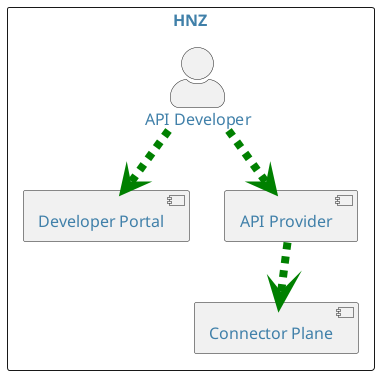
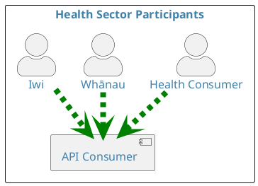
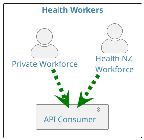
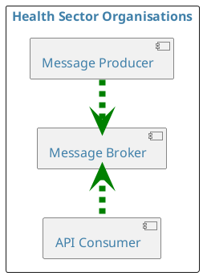

This section provides a list of common API standards components and their associated definitions.

## API Provider

An `API Provider` in the context of these standards is a **software application**:

- That **produces** a REST, FHIR, or Asynchronous API
- That can be **published** via the Health NZ API Marketplace or equivalent sector capability
- And has completed an **approved** API Provider **onboarding and certification** process.

## API Consumer

An `API consumer` in the context of these standards is a **software application**:

- That **consumes** a REST, FHIR, or Asynchronous API
- That is **published** via the Health NZ API Marketplace or equivalent sector capability
- And has completed an **approved** API Consumer **onboarding and certification** process.

## Health Sector Participants

A `health sector participant` in the context of these standards is a **human** that is, via a **software application**, interacting with an `API consumer` that is consuming an API that is published in the Health NZ API Marketplace or equivalent sector capability. Individual health sector participants may sometimes be referred to as `Health Consumer`.

## Health Sector Organisations

A `health sector organisation` in the context of these standards is any organisation that provides or supports health care services. This can include a wide range of organisations, from hospitals and clinics to research organisations, government agencies and non-profit organisations.

## Health Workers

A health worker in the context of these standards is any person who provides or supports health care services. This can include a wide range of occupations, from doctors and nurses to midwives, public health professionals, laboratory technicians, health technicians, medical and non-medical technicians, personal care workers, community health workers, and healers.

## API Designers

An `API Designer` in the context of these standards is a software developer or architect who specialises in designing application programming interfaces (APIs). API designers work to create APIs that are easy to use, efficient, and secure.
API designers typically have a strong understanding of software development principles and best practices. They also have a deep knowledge of the specific technologies and platforms that their APIs will be used with. They should also have a comprehensive understanding of the health sector.
API designers play a vital role in the development of modern software applications. By designing well-crafted APIs, they can make it easier for developers to integrate different applications and build new products and services.

## API Developers

An `API developer` in the context of these standards is a software engineer who designs, builds, and maintains APIs. APIs, or application programming interfaces, are sets of rules that allow different software applications to communicate with each other. API developers create APIs that allow developers to access data and functionality from other applications, without having to know the underlying implementation.

## Application Developers

An `Application Developer` in the context of these standards is a software engineer who designs, develops, tests, and deploys software applications. Application developers typically specialise in a particular type of application development, such as mobile app development, web app development, or enterprise software development.

| Characteristic    | API Developer                                                                            | Application Developer                                                                                                                                                 |
| :---------------- | :--------------------------------------------------------------------------------------- | :-------------------------------------------------------------------------------------------------------------------------------------------------------------------- |
| **Primary focus** | Developing APIs                                                                          | Developing software applications                                                                                                                                      |
| **Audience**      | Other developers                                                                         | Health sector participants                                                                                                                                            |
| **Example tasks** | Design and develop new APIs, maintain and update existing APIs, create API documentation | Gather and analyse user requirements, design and develop software applications, write and test code, debug and fix software defects, deploy and maintain applications |

## Message Producer

A `Message Producer` in the context of these standards is a software application which publishes data to API Consumers using Asynchronous APIs.

## Relationship Diagrams

```plantuml alt="Diagram showing API interactions within Health Sector organisations"
@startuml

skinparam {
    defaultFontColor #4080a9
    defaultBackgroundColor #d7f8ff
    defaultComponentColour #61d9de
    defaultActorColour #61d9de
    defaultFontSize 16
    defaultArrowThickness 6
    actorStyle awesome
    linetype polyline
}

rectangle "Health Sector Organisations" {
    component "API Consumer" as AC
    component "API Provider"  as AP
    actor "Application Developer" as APPD
    actor "API Developer" as APID
    APPD .[#green,dashed,thickness=8].> AC
    APID .[#green,dashed,thickness=8].> AP
}
@enduml
```

<DetailedDescription text="This shows the relationships between actors in health sector organisations. An API Developer at a Health Sector Organisation is an API Provider, and an Application Developer is an API consumer." />



<DetailedDescription text="The diagram explains that the API Developer interacts with the Developer Portal to access the API Provider. The API Provider communicates with the Connector Plane to facilitate the API Developer's requests." />



<DetailedDescription text="The diagram illustrates the relationships and flows between various participants in the health sector. The Health Consumer, Whānau, and Iwi actors represent individuals and groups who interact with the health sector. The API Consumer component represents a system that collects data from these actors." />



<DetailedDescription text="The Health Worker API Consumption diagram illustrates the relationships and flows between the Health NZ Workforce and Private Workforce actors, who both interact with the API Consumer." />



<DetailedDescription text="This shows the relationships between actors in health sector organisations. A Message Producer at a Health Sector Organisation publishes data to the Message Broker, to be consumed by an API Consumer." />
