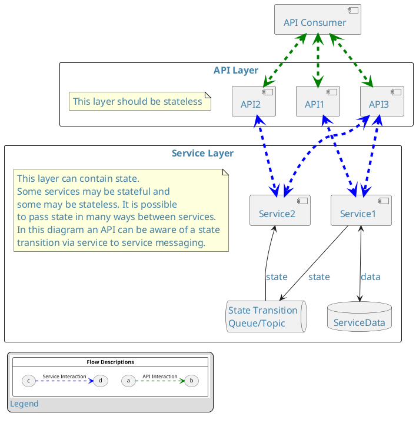
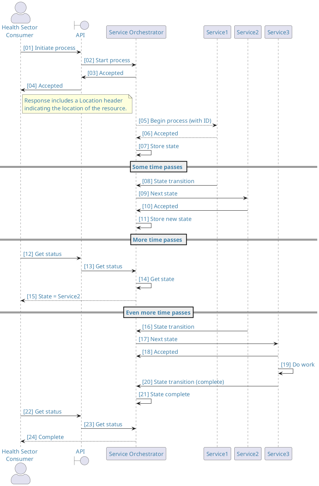

## Consideration of state

<ApiStandard id="HNZAS_SHOULD_USE_STATELESS_REST_API" type="SHOULD" toolTip="A REST API SHOULD be stateless.">In almost all cases a REST API **SHOULD** be entirely stateless.</ApiStandard>

As part of
processing it is possible for an API to gather context and pass this to
a downstream system, however an API should not maintain that context for
future requests. This should not be confused with caching, as discussed
in [the Caching section](./Caching) of this document.

<DetailedDescription text="This diagram depicts the flow where the API Consumer interacts with the API Layer, which consists of API1, API2, and API3. The API Layer should be stateless and forwards requests to the Service Layer, which contains Service1, Service2, ServiceData, and the State Transition Queue/Topic. The Service Layer can contain state, and some services may be stateful while others are stateless. State can be passed between services in various ways. In this diagram, an API can be notified of a state transition via service-to-service messaging. Service1 interacts with ServiceData for data access and sends state updates to the State Transition Queue/Topic. Service2 also interacts with the State Transition Queue/Topic to receive state updates." />

## State in Process APIs

In some solution domains, API providers need to implement services that are process-driven, whether *short-running* (when a process can be completed within one consumer request) or *long-running* (the process persists over many requests and potentially long period of time).  

In these cases the 'state' of the process flow is usually important to the API consumer as it affects the actions a user can take next.  <ApiStandard id="HNZAS_MUST_PROVIDE_PROCESS_STATE_MECHANISM" type="MUST" toolTip="RESTful APIs that embody process workflow MUST provide a mechanism for the API consumer to retrieve the current state of their process.">RESTful APIs that embody process workflow **MUST** provide a mechanism for the API consumer to retrieve the current state of their process.</ApiStandard>

As process flows are typically very specific to the business solution domain an API is supporting, it is prudent to implement the specific state model and flow logic in a single logical component for ease of testing and maintenance.  This can be done by interposing a **service orchestrator** as illustrated below.  The service orchestrator takes care of dispatching requests to services appropriate for the current process position and keeping track of the overall process flow state.

The API implemented like this is able to call on the service orchestrator to carry out process steps, and can ascertain process state at any time.

<DetailedDescription text="This PlantUML diagram illustrates how a service orchestrator can be used to keep track of process state during interactions between a Health Sector Consumer (HSC) and various services involved in processing a request. The HSD consumes the API which is a mere facade over the Service Orchestrator (SO), which in turn manages the execution of multiple services (Service1, Service2, and Service3) to fulfill the request. Detailed Breakdown: 1: Initiation: The HSC initiates the process by sending a request to the API. 2: Process Start: The API receives the request and forwards it to the SO, which starts the processing workflow. 3; Acknowledgement: The SO acknowledges both the API and the HSC, indicating the successful initiation of the process. 4: Location Header: The HSC receives a response from the API, including a Location header that provides the status of the resource. 5: Service Orchestration: The SO communicates with Service1 to begin the process, passing along the request details. Service1 acknowledges the request and updates the SO with the current state. 6: State Transition: After some time, Service1 notifies the SO of a state transition, indicating progress. The SO instructs Service2 to handle the next stage. 7: State Storage: The SO stores the updated state information and forwards it to Service2, which acknowledges receipt. 8: Status Check: The HSC inquires about the status of the request by sending a request to the API. The API relays the request to the SO. 9: State Retrieval: The SO retrieves the current state information and sends it back to the HSC, indicating that the process is still ongoing at Service2. 10: State Completion: Service2 completes its task and notifies the SO of a state transition, indicating that the process has moved to Service3. The SO updates its state records accordingly. 11: Work Execution: Service3 takes over and performs the necessary work related to the request. 12: Final State Transition: Upon completion, Service3 informs the SO of the final state transition, signifying that the process is complete. 13: Status Update: The HSC again checks the status, and the API, through the SO, provides the updated information, confirming the successful completion of the process. This diagram effectively illustrates the workflow of processing a request in the Health Sector, highlighting the involvement of various services and the role of the SO in orchestrating and monitoring the process." />
