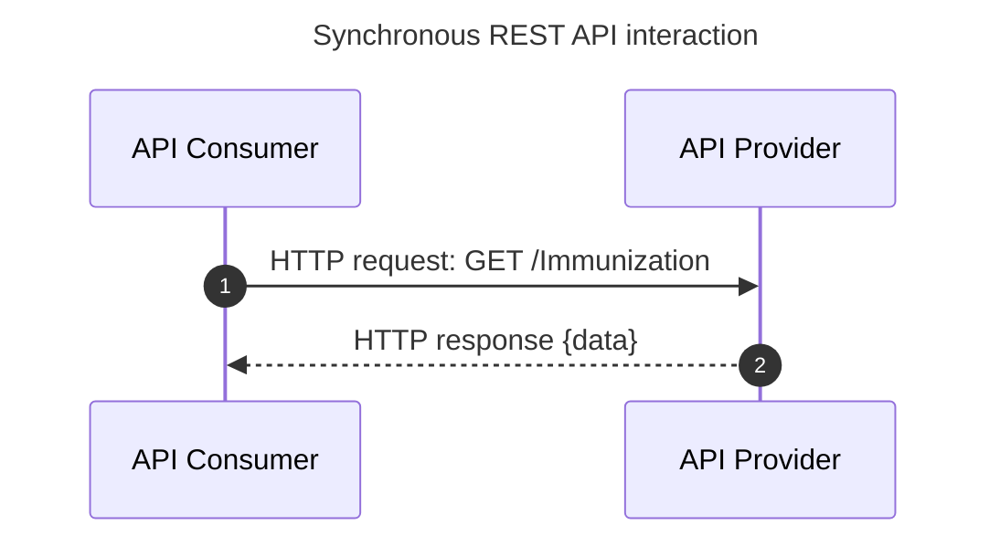
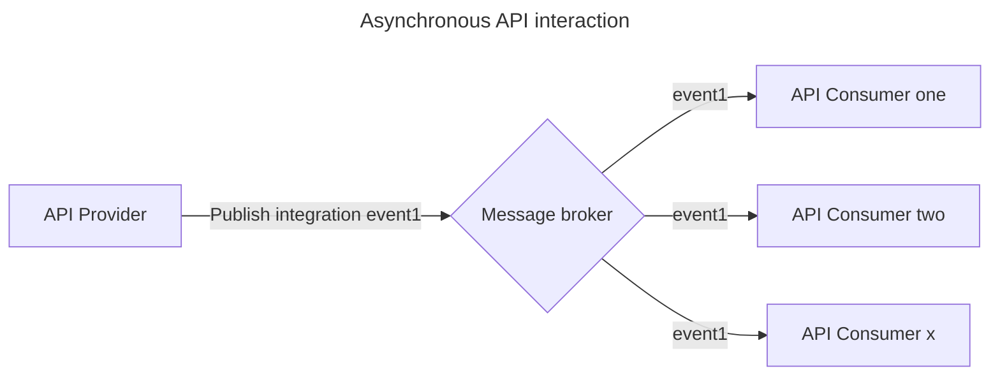

The biggest difference between REST and Asynchronous APIs is the way data is passed between clients and servers - which can be referred to as the Asynchronous Patterns.

A typical synchronous REST API interaction is modelled below (the request/response pattern):

<DetailedDescription text="In the diagram, the API Consumer is represented by the participant Client, and the API Provider is represented by the participant Server. The API Consumer sends an HTTP request to the API Provider, and the API Provider sends an HTTP response back to the API Consumer. The data that is exchanged between the API Consumer and the API Provider is represented by the {data} placeholder."/>

This illustrates an API Consumer making a request to an API Provider, and the API Provider returning a response to the API Consumer in the same, single interaction, which is typically completed within a few seconds. The API Consumer **waits** for the response in this synchronous interaction, and there is only a single consumer.

An asynchronous interaction is different in that it is typically a "fire and forget" model, when an API Provider drives the interaction by publishing an event to an intermediary piece of software such as a message broker or queue. API Consumers can then process the message at a later point in time, or often in real-time.

<DetailedDescription text="In the diagram, there is an API Provider, a message broker, and three API Consumers. The API Provider publishes an event to the message broker, and the message broker then routes the event to the API Consumers."/>
Asynchronous APIs have a number of different communication patterns which are suited to a variety of different use cases.

For the New Zealand Health Sector data sharing use cases, the [Publish Subscribe](./02-PubSub.md) model is most appropriate, and informs the focus of the Standards content.

### Asynchronous API Patterns

- [Publish Subscribe](./02-PubSub.md)
- [Point to point](./03-PointToPoint.md)
- [Request reply](./04-RequestReply.md)